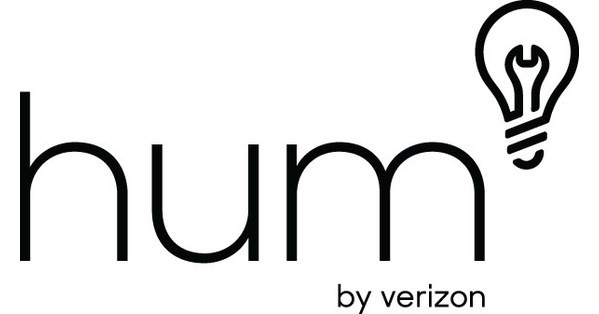
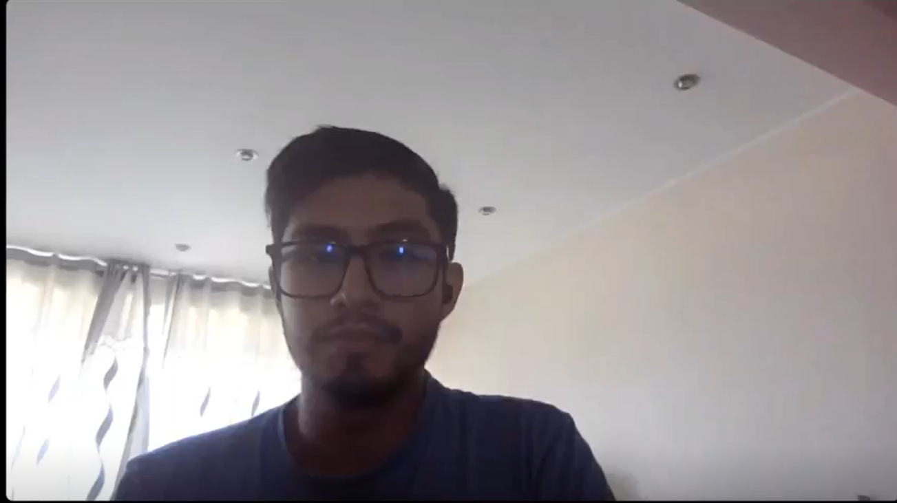
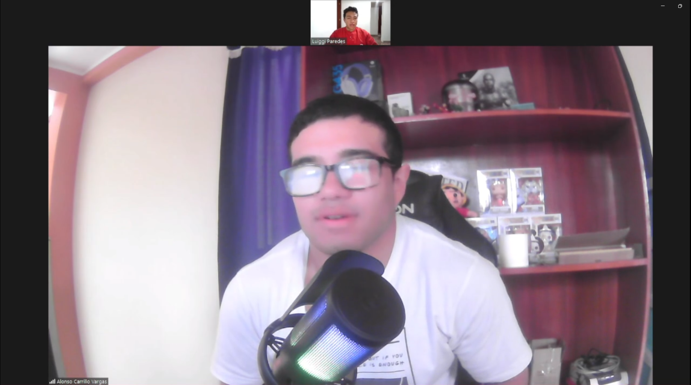
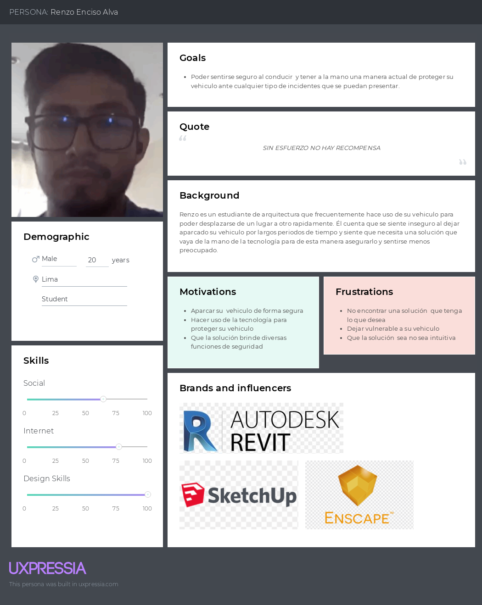

# **Capítulo II:  Requirements Elicitation & Analysis**
## 2.1 Competidores
  
***Zendrive:*** Zendrive es una aplicación que utiliza tecnología de inteligencia artificial para monitorear el comportamiento de conducción y proporcionar retroalimentación sobre la seguridad del conductor. Utiliza sensores de teléfonos inteligentes para recopilar datos sobre la aceleración, frenado, giros y otras métricas de conducción para evaluar el riesgo y la seguridad.  
 
***Life360:*** Life360 es una aplicación de seguimiento de ubicación diseñada para ayudar a las familias a mantenerse conectadas y seguras. Permite a los usuarios compartir su ubicación en tiempo real con miembros de la familia y amigos, así como recibir notificaciones sobre la llegada y salida de lugares específicos, como el hogar, la escuela o el trabajo.
 
***Hum by Verizon:*** Hum by Verizon es un dispositivo conectado para automóviles que ofrece una variedad de características relacionadas con la seguridad, el diagnóstico del vehículo y la asistencia en carretera. Permite a los conductores monitorear la salud de su vehículo, recibir alertas de mantenimiento y acceder a servicios de asistencia en carretera con solo presionar un botón.
## 2.1.1 Análisis Competitivo
<table border="1" style="text-align: center;">
	<tbody>
		<tr>
			<td colspan="6">Competitive Analysis Landscape</td>
		</tr>
		<tr>
			<td colspan="2">¿Por que llevar a cabo este análisis?</td>
			<td colspan="4">Llevar a cabo este análisis nos brindará información crítica que nos permitirá tomar decisiones más informadas y estratégicas para el desarrollo, comercialización y crecimiento de nuestra aplicación</td>
		</tr>
		<tr>
			<td colspan="2"></td>
			<td>SecurCar</td>
			<td>Zendrive</td>
			<td>Life360</td>
			<td>Hum  by Verizon</td>
		</tr>
		<tr>
			<td rowspan="2">Perfil</td>
			<td>Overview</td>
			<td></td>
			<td></td>
			<td></td>
			<td></td>
		</tr>
		<tr>
			<td>Ventaja competitiva ¿Que valor ofrece a los clientes?</td>
			<td></td>
			<td> </td>
			<td></td>
			<td>  </td>
		</tr>
		<tr>
			<td rowspan="2">Perfil de Marketing</td>
			<td>Mercado objetivo</td>
			<td></td>
			<td></td>
			<td> </td>
			<td></td>
		</tr>
		<tr>
			<td>Estrategias de marketing</td>
			<td></td>
			<td></td>
			<td></td>
			<td></td>
		</tr>
		<tr>
			<td rowspan="3">Perfil de Producto</td>
			<td>Productos &amp; Servicios</td>
			<td></td>
			<td></td>
			<td></td>
			<td></td>
		</tr>
		<tr>
			<td>Precios &amp; Costos</td>
			<td></td>
			<td></td>
			<td></td>
			<td></td>
		</tr>
		<tr>
			<td>Canales de distribución (Web y/o Móvil)</td>
			<td>Disponible en línea a través de la aplicación móvil y la plataforma web.</td>
			<td>Disponible en línea a través de la aplicación móvil y la plataforma web.</td>
			<td>Disponible en línea a través de la aplicación móvil y la plataforma web.</td>
			<td>Disponible en línea a través de la aplicación móvil y la plataforma web.</td>
		</tr>
		<tr>
			<td rowspan="4">Análisis SWOT</td>
			<td>Fortalezas</td>
			<td>
                <ul>
                    <li></li>
                    <li></li>
                    <li></li>
                </ul>
            </td>
			<td>
                <ul>
                    <li></li>
                    <li></li>
                    <li></li>
                </ul>
            </td>
			<td>
                <ul>
                    <li></li>
                    <li></li>
                    <li></li>
                </ul>
            </td>
			<td>
                <ul>
                    <li></li>
                    <li></li>
                    <li></li>
                </ul>
            </td>
		</tr>
		<tr>
			<td>Debilidades</td>
			<td>
                <ul>
                    <li></li>
                    <li></li>
                </ul>
            </td>
			<td>
                <ul>
                    <li></li>
                    <li></li>
                </ul>
            </td>
			<td>
                <ul>
                    <li></li>
                    <li></li>
                </ul>
            </td>
			<td>
                <ul>
                    <li></li>
                    <li></li>
                </ul>
            </td>
		</tr>
		<tr>
			<td>Oportunidades</td>
			<td>
                <ul>
                    <li></li>
                    <li></li>
                </ul>
            </td>
			<td>
                <ul>
                    <li></li>
                    <li></li>
                </ul>
            </td>
			<td>
                <ul>
                    <li></li>
                    <li></li>
                </ul>
            </td>
			<td>
                <ul>
                    <li></li>
                    <li></li>
                </ul>
            </td>
		</tr>
		<tr>
			<td>Amenazas</td>
			<td>
                <ul>
                    <li></li>
                    <li></li>
                </ul>
            </td>
			<td>
                <ul>
                    <li></li>
                    <li></li>
                </ul>
            </td>
			<td>
                <ul>
                    <li></li>
                    <li></li>
                </ul>
            </td>
			<td>
                <ul>
                    <li></li>
                    <li></li>
                </ul>
            </td>
		</tr>
	</tbody>
</table>

### 2.1.2. Estrategias y tácticas frente a competidores.
1.  **Diferenciación del Producto:**
    *   Integra características de gamificación para incentivar hábitos de conducción seguros y premiar a los usuarios jóvenes.
    *   Ofrece opciones de personalización como alertas específicas para padres o tutores sobre la conducción de sus hijos.
2.  **Marketing Dirigido:**
    *   Utiliza campañas en redes sociales que resalten la importancia de la seguridad vial para los jóvenes y cómo tu dispositivo y app pueden ayudar.
    *   Colabora con influencers jóvenes que puedan conectar con la audiencia objetivo.
3.  **Precios Competitivos:**
    *   Ofrece paquetes o descuentos especiales para estudiantes universitarios o jóvenes trabajadores, haciendo que tu producto sea más accesible.
    *   Implementa modelos de suscripción flexibles que se adapten a las necesidades financieras de los jóvenes conductores.
4.  **Facilidad de Uso:**
    *   Diseña una interfaz de usuario intuitiva y atractiva, con tutoriales o guías que faciliten la comprensión y uso de tu dispositivo y app.
    *   Asegúrate de que la instalación y configuración sean sencillas para los usuarios menos técnicos.
5.  **Feedback y Mejora Continua:**
    *   Incorpora una sección de retroalimentación dentro de la app para que los usuarios compartan sus experiencias y sugerencias de mejora.
    *   Mantén actualizado el producto con actualizaciones periódicas que agreguen nuevas funciones basadas en las necesidades de los jóvenes conductores.

## 2.2. Entrevistas.
El objetivo de las entrevistas es obtener una comprensión profunda de las experiencias, perspectivas y opiniones de los segmentos de mercado seleccionados. Nuestra meta es recopilar información valiosa que nos permita entender mejor a nuestro público objetivo y mejorar nuestra comprensión de los usuarios. Estas conversaciones nos proporcionarán una visión más clara de las necesidades y deseos de nuestros usuarios, lo que nos ayudará a adaptar nuestros productos o servicios de manera más efectiva a sus requisitos.
### 2.2.1. Diseño de entrevistas.
* ** **
### Entrevista para Taxistas:
1. Introducción
* Saludo y agradecimiento por su participación.
* Breve explicación del propósito de la entrevista.
2. Información de fondo
* Preguntas sobre su experiencia como taxista.
* ¿Qué desafíos o preocupaciones tienen en relación con la seguridad de su vehículo?
3. Uso actual de la tecnología
* ¿Utilizan actualmente algún dispositivo de seguridad en sus vehículos?
* ¿Cómo gestionan la seguridad de su vehículo mientras trabajan?
4. Percepción sobre la aplicación propuesta
* ¿Qué características les gustaría ver en una aplicación de seguridad vehicular?
* ¿Cómo creen que una aplicación podría mejorar su seguridad y la de su vehículo?
5. Feedback sobre el modelo de suscripción
* ¿Estarían dispuestos a pagar por un servicio de seguridad vehicular basado en suscripción mensual?
* ¿Qué características o beneficios considerarían más valiosos para justificar el costo de la suscripción?
6. Cierre
* Preguntas finales y agradecimiento por su tiempo.
* Invitación a proporcionar cualquier información adicional que consideren relevante.
* ** **
### Entrevista para Jóvenes:
1. Introducción
* Saludo y agradecimiento por su participación.
* Breve explicación del propósito de la entrevista.
2. Estilo de vida y necesidades de seguridad
* Preguntas sobre su estilo de vida y actividades diarias.
* ¿Cuáles son sus principales preocupaciones en términos de seguridad cuando se trata de conducir o viajar en un automóvil?
3. Uso de aplicaciones móviles y tecnología
* ¿Qué aplicaciones móviles utilizan con frecuencia y para qué propósitos?
* ¿Cómo creen que una aplicación móvil podría contribuir a su seguridad al conducir?
4. Percepción sobre la propuesta de la aplicación
* ¿Qué características considerarían más útiles en una aplicación de seguridad vehicular dirigida a jóvenes?
* ¿Qué aspectos de diseño o funcionalidad serían más atractivos para ustedes en una aplicación de este tipo?
5. Opinión sobre el modelo de suscripción
* ¿Estarían dispuestos a pagar por un servicio de seguridad vehicular basado en suscripción mensual?
* ¿Qué características o beneficios les resultarían más convincentes para suscribirse al servicio?
6. Cierre
* Preguntas finales y agradecimiento por su tiempo.
* Invitación a proporcionar cualquier información adicional que consideren relevante.
### 2.2.2. Registro de entrevistas.
- **Taxistas Experimentados:**

- **Conductores Jóvenes:** 
**Entrevista #1**  
Nombre y apellidos: Renzo Enciso  
Edad: 20 años  
Distrito: Chorrillos 
  
Inicio De Entrevista: 0:20  
[URL_De_Entrevista](https://upcedupe-my.sharepoint.com/:v:/g/personal/u202213652_upc_edu_pe/EXLXrFkgAdxKrW3XY3y6EfoBk7vH6voQFgdeXxhfn7gkwA?e=ygN2SL&nav=eyJyZWZlcnJhbEluZm8iOnsicmVmZXJyYWxBcHAiOiJTdHJlYW1XZWJBcHAiLCJyZWZlcnJhbFZpZXciOiJTaGFyZURpYWxvZy1MaW5rIiwicmVmZXJyYWxBcHBQbGF0Zm9ybSI6IldlYiIsInJlZmVycmFsTW9kZSI6InZpZXcifX0%3D)  
Resumen De Entrevista: Según las respuestas proporcionadas, el entrevistado expresa preocupaciones clave en relación a la seguridad al conducir, destacando el temor al robo del vehículo y la seguridad personal durante los viajes. Su uso frecuente de aplicaciones móviles incluye herramientas de navegación y redes sociales para mantenerse conectado mientras está en movimiento. Considera que una aplicación móvil podría mejorar significativamente su seguridad al proporcionar alertas en tiempo real sobre áreas de alto riesgo y funciones de rastreo de vehículos. Valora especialmente características como alertas de robo, asistencia en caso de emergencia y consejos sobre seguridad vial, buscando una interfaz intuitiva y atractiva. Estaría dispuesto a pagar por un servicio de seguridad vehicular si ofrece beneficios como prevención de robos eficaz y asistencia en emergencias, destacando la importancia de una comunidad activa de usuarios y un equipo de soporte receptivo.
**Entrevista #2**  
Nombre y apellidos: Daniela Chavez  
Edad: 21 años  
Distrito: Magdalena del mar  
 
Inicio de Entrevista: XX:XX  
[URL_De_Entrevista](https://Google.com) 
Resumen de entrevista: Segun las respuestas proporcionadas por la entrevistada, expresa sus anhelos a la aplicación, mencionando que le gustaria que existiesen funciones para saber donde se encuentra su carro, debido a que a veces lo pierde de vista. Ademas menciona que si le gustaria que de consejos sobre que hacer en ciertas situaciones. También le gustaría que recomiende mejores, rutas, que te ayude a llevar los papeles del carro, cuando se vencerán y que te advierta sobre estos. Ella estaría dispuesto a pagar por un precio accesible y con beneficios a largo plazo, le gustaría que tenga descuentos por si eres estudiante o si tiene convenios con otras empresas.
  **Entrevista #3**  
  Nombre y apellidos: Alonso Carrillo  
  Edad: 23 años  
  Distrito: Santiago de Surco  
   
  Inicio de Entrevista: 00:15  
  [URL_De_Entrevista](https://upcedupe-my.sharepoint.com/:v:/g/personal/u202218996_upc_edu_pe/EQRXQZpSP15LmIG-bDE3meUBJDE9VXsy-g-VOnqd8tqqfQ?e=JIhHb6) 
  Resumen de entrevista: Segun las respuestas proporcionadas por el entrevistado, sufrio un robo a mano armada y desde ese evento siempre tiene un miedo constante. Considera que una aplicación podría mejorar su seguridad al proporcionar alertas en tiempo real sobre áreas de alto riesgo y ofrecerle la posibilidad de contactar a la policia.  Estaría dispuesto a pagar por un servicio de seguridad vehicular de manera mensual si cumple sus expectativas. 
### 2.2.3. Análisis de entrevistas.
## 2.3. Needfinding.
### 2.3.1. User Personas.
- User Persona Primer Segmento Objetivo: Taxistas Adultos 

- User Persona Segundo Segmento Objetivo: Conductores Jóvenes
  
### 2.3.2. User Task Matrix.
<table>
    <tbody>
<tr>
    <td rowspan="2">Task/Segmento Objetivo</td>
    <td colspan="2">User Persona #1   (Taxistas Adultos)</td>
    <td colspan="2">User Persona #2   (Conductores Jóvenes)</td>
</tr>
<tr>
    <td >Frecuencia</td>
    <td >Importancia De Tarea</td>
    <td >Frecuencia</td>
    <td >Importancia De Tarea</td>
</tr>
<tr>
    <td >Encontrar estacionamiento seguro</td>
    <td >Cuando el usuario lo requiera </td>
    <td > Medio</td>
    <td >Cuando el usuario lo requiera</td>
    <td >Medio</td>
</tr>
<tr>
    <td >Proteger el vehículo contra robos</td>
    <td >Siempre</td>
    <td > Alta</td>
    <td >Siempre</td>
    <td >Alta</td>
</tr>
<tr>
    <td >Utilizar la herramienta para recibir alertas de seguridad en tiempo real</td>
    <td >Siempre</td>
    <td >Alta </td>
    <td >Siempre</td>
    <td >Alta</td>
</tr>
<tr>
    <td >Aprender a usar la herramienta de seguridad de manera efectiva</td>
    <td >Una sola vez</td>
    <td > Media</td>
    <td >Una sola vez</td>
    <td >Media</td>
</tr>
<tr>
    <td >Compartir información sobre incidentes de seguridad con otros usuarios</td>
    <td >Cuando el usuario lo requiera</td>
    <td >Media </td>
    <td >Cuando el usuario lo requiera</td>
    <td >Media</td>
</tr>
<tr>
    <td >Reportar problemas de seguridad a las autoridades pertinentes</td>
    <td >Cuando el usuario lo requiera</td>
    <td >Alta</td>
    <td >Cuando el usuario lo requiera</td>
    <td >Alta</td>
</tr>
<tr>
    <td >Leer noticias relacionadas con la seguridad vial y prevención de robos</td>
    <td >Periodica</td>
    <td >Baja</td>
    <td >Periodica</td>
    <td >Baja</td>
</tr>
<tr>
    <td >Participar en programas de capacitación sobre seguridad vial</td>
    <td >Cuando el usuario desee unirse</td>
    <td >Baja</td>
    <td >Cuando el usuario desee unirse</td>
    <td >Baja</td>
</tr>
    </tbody>

</table>

### 2.3.3. User Journey Mapping
### 2.3.4. Empathy Mapping.
### 2.3.5. As-is Scenario Mapping.
## 2.4. Ubiquitous Language