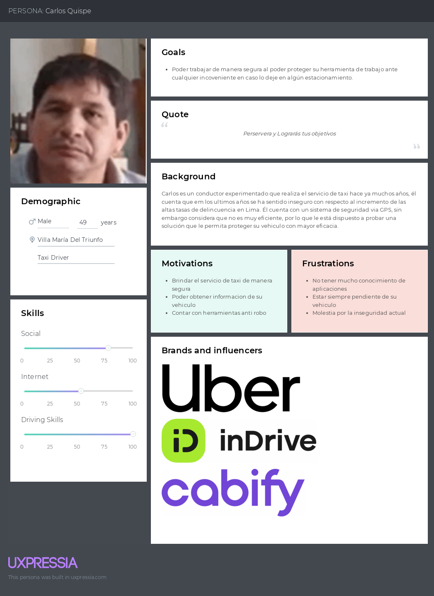
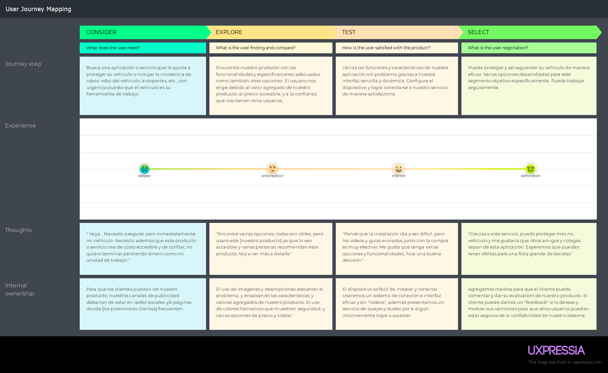
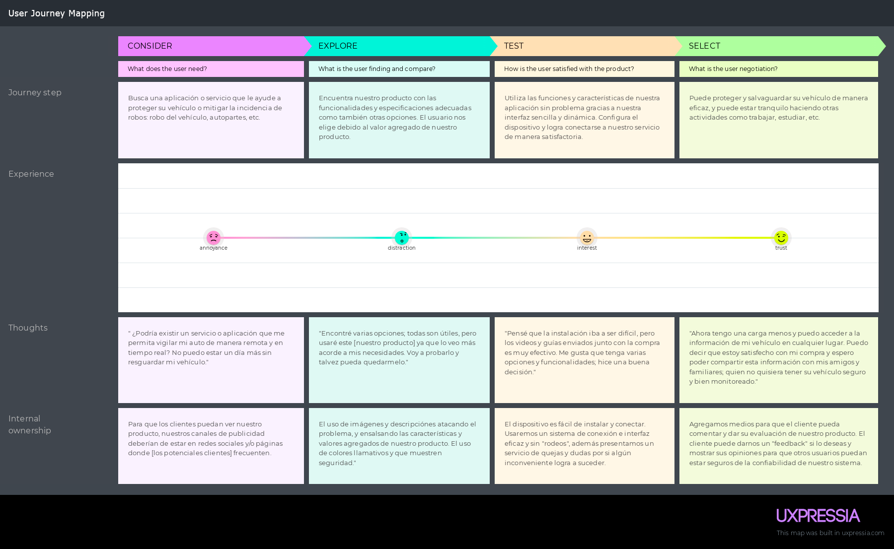
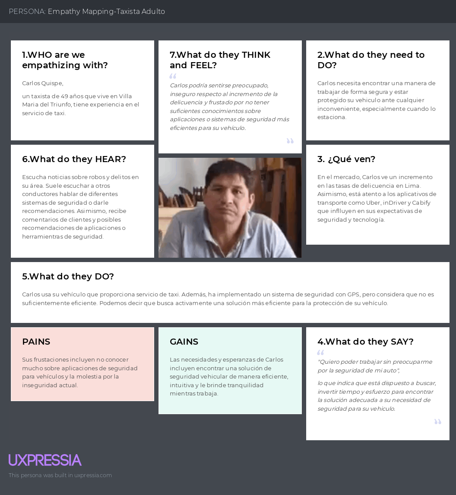
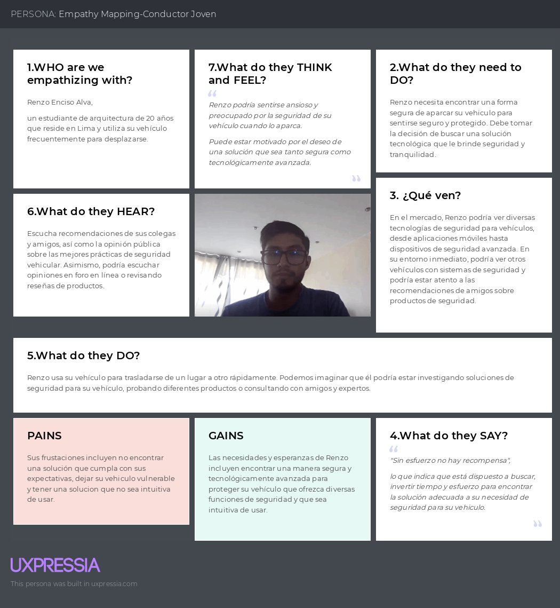
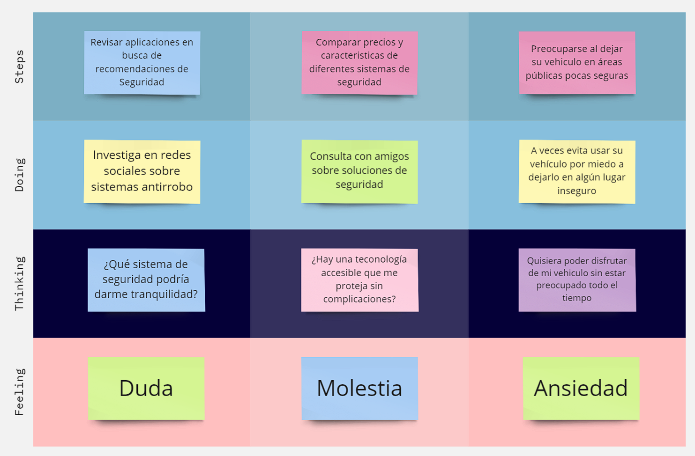

# **Capítulo II:  Requirements Elicitation & Analysis**
## 2.1 Competidores
  
***Zendrive:*** Zendrive es una aplicación que utiliza tecnología de inteligencia artificial para monitorear el comportamiento de conducción y proporcionar retroalimentación sobre la seguridad del conductor. Utiliza sensores de teléfonos inteligentes para recopilar datos sobre la aceleración, frenado, giros y otras métricas de conducción para evaluar el riesgo y la seguridad.  
 
***Life360:*** Life360 es una aplicación de seguimiento de ubicación diseñada para ayudar a las familias a mantenerse conectadas y seguras. Permite a los usuarios compartir su ubicación en tiempo real con miembros de la familia y amigos, así como recibir notificaciones sobre la llegada y salida de lugares específicos, como el hogar, la escuela o el trabajo.
 
***Hum by Verizon:*** Hum by Verizon es un dispositivo conectado para automóviles que ofrece una variedad de características relacionadas con la seguridad, el diagnóstico del vehículo y la asistencia en carretera. Permite a los conductores monitorear la salud de su vehículo, recibir alertas de mantenimiento y acceder a servicios de asistencia en carretera con solo presionar un botón.
## 2.1.1 Análisis Competitivo
<table border="1" style="text-align: center;">
	<tbody>
		<tr>
			<td colspan="6">Competitive Analysis Landscape</td>
		</tr>
		<tr>
			<td colspan="2">¿Por que llevar a cabo este análisis?</td>
			<td colspan="4">Llevar a cabo este análisis nos brindará información crítica que nos permitirá tomar decisiones más informadas y estratégicas para el desarrollo, comercialización y crecimiento de nuestra aplicación</td>
		</tr>
		<tr>
			<td colspan="2"></td>
			<td>SecurCar</td>
			<td>Zendrive</td>
			<td>Life360</td>
			<td>Hum  by Verizon</td>
		</tr>
		<tr>
			<td rowspan="2">Perfil</td>
			<td>Overview</td>
			<td>Sistema que mitiga (y previene) los robos a vehículos.</td>
			<td>Sistema que previene accidentes vehiculares, y regula la seguridad vial</td>
			<td>Sistema que localiza y alerta sobre la seguridad e integridad de una persona</td>
			<td>Sistema que monitorea el automóvil y alerta ante cualquier accidente automovilístico</td>
		</tr>
		<tr>
			<td>Ventaja competitiva ¿Que valor ofrece a los clientes?</td>
			<td>Monitoreo y vigilancia del vehículo en tiempo real</td>
			<td>Regula la seguridad vehicular y relacionados</td>
			<td>Localización de una persona en tiempo real</td>
			<td>Detección de choques, servicios de mecánica; actúa como seguro</td>
		</tr>
		<tr>
			<td rowspan="2">Perfil de Marketing</td>
			<td>Mercado objetivo</td>
			<td>Todos los conductores en general; jóvenes y taxistas principalmente.</td>
			<td>Todos los conductores en general</td>
			<td>Todo el público</td>
			<td>Todos los conductores en general</td>
		</tr>
		<tr>
			<td>Estrategias de marketing</td>
			<td>Promociones y anuncios en páginas, sitios web, periódicos, etc., lugares comunes donde se encuentre nuestro segmento objetivo</td>
			<td>Redes sociales y páginas de internet; también en parte con organizaciones</td>
			<td>Anuncios de internet, recomendaciones y en general anuncios comunes</td>
			<td>Anuncios de internet y páginas de internet; junto con seguros.</td>
		</tr>
		<tr>
			<td rowspan="3">Perfil de Producto</td>
			<td>Productos &amp; Servicios</td>
			<td>Dispositivos, servicios y software</td>
			<td>Servicios y sistemas integrados</td>
			<td>Dispositivos, servicios y software</td>
			<td>Sistemas y servicios integrados</td>
		</tr>
		<tr>
			<td>Precios &amp; Costos</td>
			<td>Tarifas y precios de acuerdo a las necesidades del cliente</td>
			<td>Tarifas y precios de acuerdo a las necesidades del cliente</td>
			<td>Tarifas y precios de acuerdo a las necesidades del cliente</td>
			<td>Tarifas y precios: desde 10 a 20 dólares.</td>
		</tr>
		<tr>
			<td>Canales de distribución (Web y/o Móvil)</td>
			<td>Disponible en línea a través de la aplicación móvil y la plataforma web.</td>
			<td>Disponible en línea a través de la aplicación móvil y la plataforma web.</td>
			<td>Disponible en línea a través de la aplicación móvil y la plataforma web.</td>
			<td>Disponible en línea a través de la aplicación móvil y la plataforma web.</td>
		</tr>
		<tr>
			<td rowspan="4">Análisis SWOT</td>
			<td>Fortalezas</td>
			<td>
                <ul>
                    <li>Sistema de localización y sensores que muestran el entorno del vehículo en tiempo real.</li>
                </ul>
            </td>
			<td>
                <ul>
                    <li>Especialización de sistemas integrados y detección avanzada.</li>
                </ul>
            </td>
			<td>
                <ul>
                    <li>Uso especializado para la localización de personas y rastreo en ciertos casos.</li>
                </ul>
            </td>
			<td>
                <ul>
                    <li>Puede usar sistemas especializados en cierto casos.</li>
                </ul>
            </td>
		</tr>
		<tr>
			<td>Debilidades</td>
			<td>
                <ul>
                    <li>El sistema aún sigue en procesos de desarrollo y puede no tener todas las funcionalidades completas.</li>
                </ul>
            </td>
			<td>
                <ul>
                    <li>Falta de conocimiento y uso entre los potenciales usuarios.</li>
                </ul>
            </td>
			<td>
                <ul>
                    <li>Puede ser usado para el rastreo.</li>
                </ul>
            </td>
			<td>
                <ul>
                    <li>Puede ser de costo elevado para ciertos casos.</li>
                </ul>
            </td>
		</tr>
		<tr>
			<td>Oportunidades</td>
			<td>
                <ul>
                    <li>Reconoce el estado del auto y notificar al usuario.</li>
                </ul>
            </td>
			<td>
                <ul>
                    <li>Alerta para varios usuarios como familiares y conocidos.</li>
                </ul>
            </td>
			<td>
                <ul>
                    <li>Especializado para el uso personal y rastreo.</li>
                </ul>
            </td>
			<td>
                <ul>
                    <li>Sistema avanzado y delimitado para ciertos usuarios.</li>
                </ul>
            </td>
		</tr>
		<tr>
			<td>Amenazas</td>
			<td>
                <ul>
                    <li>El precio puede ser variable y en algunos casos molestoso.</li>
                </ul>
            </td>
			<td>
                <ul>
                    <li>El sistema no es muy conocido y puede ser difícil el uso en diferentes países.</li>
                </ul>
            </td>
			<td>
                <ul>
                    <li>La funcionalidad es limitada en cuanto a el uso vehicular.</li>
                </ul>
            </td>
			<td>
                <ul>
                    <li>El sistema puede ser limitado debido a la conexión a internet.</li>
                </ul>
            </td>
		</tr>
	</tbody>
</table>

### 2.1.2. Estrategias y tácticas frente a competidores.
1.  **Diferenciación del Producto:**
    *   Integra características de gamificación para incentivar hábitos de conducción seguros y premiar a los usuarios jóvenes.
    *   Ofrece opciones de personalización como alertas específicas para padres o tutores sobre la conducción de sus hijos.
2.  **Marketing Dirigido:**
    *   Utiliza campañas en redes sociales que resalten la importancia de la seguridad vial para los jóvenes y cómo tu dispositivo y app pueden ayudar.
    *   Colabora con influencers jóvenes que puedan conectar con la audiencia objetivo.
3.  **Precios Competitivos:**
    *   Ofrece paquetes o descuentos especiales para estudiantes universitarios o jóvenes trabajadores, haciendo que tu producto sea más accesible.
    *   Implementa modelos de suscripción flexibles que se adapten a las necesidades financieras de los jóvenes conductores.
4.  **Facilidad de Uso:**
    *   Diseña una interfaz de usuario intuitiva y atractiva, con tutoriales o guías que faciliten la comprensión y uso de tu dispositivo y app.
    *   Asegúrate de que la instalación y configuración sean sencillas para los usuarios menos técnicos.
5.  **Feedback y Mejora Continua:**
    *   Incorpora una sección de retroalimentación dentro de la app para que los usuarios compartan sus experiencias y sugerencias de mejora.
    *   Mantén actualizado el producto con actualizaciones periódicas que agreguen nuevas funciones basadas en las necesidades de los jóvenes conductores.

## 2.2. Entrevistas.
El objetivo de las entrevistas es obtener una comprensión profunda de las experiencias, perspectivas y opiniones de los segmentos de mercado seleccionados. Nuestra meta es recopilar información valiosa que nos permita entender mejor a nuestro público objetivo y mejorar nuestra comprensión de los usuarios. Estas conversaciones nos proporcionarán una visión más clara de las necesidades y deseos de nuestros usuarios, lo que nos ayudará a adaptar nuestros productos o servicios de manera más efectiva a sus requisitos.
### 2.2.1. Diseño de entrevistas.
* ** **
### Entrevista para Taxistas:
1. Introducción
* Saludo y agradecimiento por su participación.
* Breve explicación del propósito de la entrevista.
2. Información de fondo
* Preguntas sobre su experiencia como taxista.
* ¿Qué desafíos o preocupaciones tienen en relación con la seguridad de su vehículo?
3. Uso actual de la tecnología
* ¿Utilizan actualmente algún dispositivo de seguridad en sus vehículos?
* ¿Cómo gestionan la seguridad de su vehículo mientras trabajan?
4. Percepción sobre la aplicación propuesta
* ¿Qué características les gustaría ver en una aplicación de seguridad vehicular?
* ¿Cómo creen que una aplicación podría mejorar su seguridad y la de su vehículo?
5. Feedback sobre el modelo de suscripción
* ¿Estarían dispuestos a pagar por un servicio de seguridad vehicular basado en suscripción mensual?
* ¿Qué características o beneficios considerarían más valiosos para justificar el costo de la suscripción?
6. Cierre
* Preguntas finales y agradecimiento por su tiempo.
* Invitación a proporcionar cualquier información adicional que consideren relevante.
* ** **
### Entrevista para Jóvenes:
1. Introducción
* Saludo y agradecimiento por su participación.
* Breve explicación del propósito de la entrevista.
2. Estilo de vida y necesidades de seguridad
* Preguntas sobre su estilo de vida y actividades diarias.
* ¿Cuáles son sus principales preocupaciones en términos de seguridad cuando se trata de conducir o viajar en un automóvil?
3. Uso de aplicaciones móviles y tecnología
* ¿Qué aplicaciones móviles utilizan con frecuencia y para qué propósitos?
* ¿Cómo creen que una aplicación móvil podría contribuir a su seguridad al conducir?
4. Percepción sobre la propuesta de la aplicación
* ¿Qué características considerarían más útiles en una aplicación de seguridad vehicular dirigida a jóvenes?
* ¿Qué aspectos de diseño o funcionalidad serían más atractivos para ustedes en una aplicación de este tipo?
5. Opinión sobre el modelo de suscripción
* ¿Estarían dispuestos a pagar por un servicio de seguridad vehicular basado en suscripción mensual?
* ¿Qué características o beneficios les resultarían más convincentes para suscribirse al servicio?
6. Cierre
* Preguntas finales y agradecimiento por su tiempo.
* Invitación a proporcionar cualquier información adicional que consideren relevante.
### 2.2.2. Registro de entrevistas.
- **Taxistas Experimentados:**
  **Entrevista #1**  
  Nombre y apellidos: Alonso Carrillo  
  Edad: 23 años  
  Distrito: Santiago de Surco  
   
  Inicio de Entrevista: 00:15  
  [URL_De_Entrevista](https://upcedupe-my.sharepoint.com/:v:/g/personal/u20201e475_upc_edu_pe/EQ36Jmr56RxAsQUCmkPi_OoBGThlcK04v3YbnWPa7OVI_A?e=SjO0A6&nav=eyJyZWZlcnJhbEluZm8iOnsicmVmZXJyYWxBcHAiOiJTdHJlYW1XZWJBcHAiLCJyZWZlcnJhbFZpZXciOiJTaGFyZURpYWxvZy1MaW5rIiwicmVmZXJyYWxBcHBQbGF0Zm9ybSI6IldlYiIsInJlZmVycmFsTW9kZSI6InZpZXcifX0%3D) 
  Resumen de entrevista: Segun las respuestas proporcionadas por el entrevistado, sufrio un robo a mano armada y desde ese evento siempre tiene un miedo constante. Considera que una aplicación podría mejorar su seguridad al proporcionar alertas en tiempo real sobre áreas de alto riesgo y ofrecerle la posibilidad de contactar a la policia.  Estaría dispuesto a pagar por un servicio de seguridad vehicular de manera mensual si cumple sus expectativas.

- **Taxistas Experimentados:**
  **Entrevista #2**  
  Nombre y apellidos: Maykol Valencia  
  Edad: 22 años  
  Distrito: Selva Alegre  
   
  Inicio de Entrevista: 05:51  
  [URL_De_Entrevista](https://upcedupe-my.sharepoint.com/:v:/g/personal/u20201e475_upc_edu_pe/EQ36Jmr56RxAsQUCmkPi_OoBGThlcK04v3YbnWPa7OVI_A?e=SjO0A6&nav=eyJyZWZlcnJhbEluZm8iOnsicmVmZXJyYWxBcHAiOiJTdHJlYW1XZWJBcHAiLCJyZWZlcnJhbFZpZXciOiJTaGFyZURpYWxvZy1MaW5rIiwicmVmZXJyYWxBcHBQbGF0Zm9ybSI6IldlYiIsInJlZmVycmFsTW9kZSI6InZpZXcifX0%3D) 
  Resumen de entrevista: Según las respuestas proporcionadas, el entrevistado, ha sufrido un intento de robo al momento de dejar estacionado su vehiculo donde intentaron abrir el carro, pero no lo lograron. Asimismo, menciona que este suceso le ha sucedido como 3 veces a más. Considera que una aplicación seria lo ideal para sentirse más seguro al proporcionar alertas en tiempo real sin demora, donde se conecte con el celular y sobretodo que tenga una conexión rápida. Asimismo, estaría dispuesto a pagar por un servicio de seguridad vehicular de manera mensual donde cumpla sus expectativas.

  - **Taxistas Experimentados:**
  **Entrevista #3**  
  Nombre y apellidos: Carlos Quispe  
  Edad: 49 años  
  Distrito: Villa María del Triunfo  
   
  Inicio de Entrevista: 14:15  
  [URL_De_Entrevista](https://upcedupe-my.sharepoint.com/:v:/g/personal/u20201e475_upc_edu_pe/EQ36Jmr56RxAsQUCmkPi_OoBGThlcK04v3YbnWPa7OVI_A?e=SjO0A6&nav=eyJyZWZlcnJhbEluZm8iOnsicmVmZXJyYWxBcHAiOiJTdHJlYW1XZWJBcHAiLCJyZWZlcnJhbFZpZXciOiJTaGFyZURpYWxvZy1MaW5rIiwicmVmZXJyYWxBcHBQbGF0Zm9ybSI6IldlYiIsInJlZmVycmFsTW9kZSI6InZpZXcifX0%3D) 
  Resumen de entrevista: El señor Carlos nos cuenta sus preocupaciones respecto a su unidad de trabajo, y además nos cuenta que ya usa un sistema de vigilancia (en parte funcional) que es el GPS pero desearía que sea más eficiente. Nos cuenta que también  le gustaría que nuestro sistema sea cómodo para el bolsillo. Si cumple con funcionalidades que son específicas para este segmento entonces estaría dispuesto a usarlo.

- **Conductores Jóvenes:** 

**Entrevista #1**  
Nombre y apellidos: Renzo Enciso  
Edad: 20 años  
Distrito: Chorrillos 
  
Inicio De Entrevista: 21:38  
[URL_De_Entrevista](https://upcedupe-my.sharepoint.com/:v:/g/personal/u20201e475_upc_edu_pe/EQ36Jmr56RxAsQUCmkPi_OoBGThlcK04v3YbnWPa7OVI_A?e=SjO0A6&nav=eyJyZWZlcnJhbEluZm8iOnsicmVmZXJyYWxBcHAiOiJTdHJlYW1XZWJBcHAiLCJyZWZlcnJhbFZpZXciOiJTaGFyZURpYWxvZy1MaW5rIiwicmVmZXJyYWxBcHBQbGF0Zm9ybSI6IldlYiIsInJlZmVycmFsTW9kZSI6InZpZXcifX0%3D)  
Resumen De Entrevista: Según las respuestas proporcionadas, el entrevistado expresa preocupaciones clave en relación a la seguridad al conducir, destacando el temor al robo del vehículo y la seguridad personal durante los viajes. Su uso frecuente de aplicaciones móviles incluye herramientas de navegación y redes sociales para mantenerse conectado mientras está en movimiento. Considera que una aplicación móvil podría mejorar significativamente su seguridad al proporcionar alertas en tiempo real sobre áreas de alto riesgo y funciones de rastreo de vehículos. Valora especialmente características como alertas de robo, asistencia en caso de emergencia y consejos sobre seguridad vial, buscando una interfaz intuitiva y atractiva. Estaría dispuesto a pagar por un servicio de seguridad vehicular si ofrece beneficios como prevención de robos eficaz y asistencia en emergencias, destacando la importancia de una comunidad activa de usuarios y un equipo de soporte receptivo.

- **Entrevista #2**  
Nombre y apellidos: Daniela Chavez  
Edad: 21 años  
Distrito: Magdalena del mar  
 
Inicio de Entrevista: 26:40  
[URL_De_Entrevista](https://upcedupe-my.sharepoint.com/:v:/g/personal/u20201e475_upc_edu_pe/EQ36Jmr56RxAsQUCmkPi_OoBGThlcK04v3YbnWPa7OVI_A?e=SjO0A6&nav=eyJyZWZlcnJhbEluZm8iOnsicmVmZXJyYWxBcHAiOiJTdHJlYW1XZWJBcHAiLCJyZWZlcnJhbFZpZXciOiJTaGFyZURpYWxvZy1MaW5rIiwicmVmZXJyYWxBcHBQbGF0Zm9ybSI6IldlYiIsInJlZmVycmFsTW9kZSI6InZpZXcifX0%3D) 
Resumen de entrevista: Segun las respuestas proporcionadas por la entrevistada, expresa sus anhelos a la aplicación, mencionando que le gustaria que existiesen funciones para saber donde se encuentra su carro, debido a que a veces lo pierde de vista. Ademas menciona que si le gustaria que de consejos sobre que hacer en ciertas situaciones. También le gustaría que recomiende mejores, rutas, que te ayude a llevar los papeles del carro, cuando se vencerán y que te advierta sobre estos. Ella estaría dispuesto a pagar por un precio accesible y con beneficios a largo plazo, le gustaría que tenga descuentos por si eres estudiante o si tiene convenios con otras empresas.

**Entrevista #3**  
Nombre y apellidos: Leonardo Lopez  
Edad: 21 años  
Distrito: Surco 

  

 
Duración De Entrevista: 10:35  

[URL_De_Entrevista](https://1drv.ms/u/s!Amw9NbjIfdHJi3je53GaoZdJu0j-?e=Wm3lmY)

 

Resumen De Entrevista: 
Leonardo López, durante la entrevista, mostró un gran interés en nuestra idea de negocio centrada en una aplicación para conductores que les ayude a encontrar lugares seguros de estacionamiento. Expresó su entusiasmo por la posibilidad de tener una herramienta que le ayude a estacionar su carro de manera eficaz y segura. Su interés radica en la utilidad práctica de una app de este tipo, destacando la importancia de la seguridad y la eficiencia al estacionar.

  ### 2.2.3. Análisis de entrevistas.
\-	Análisis del Segmento Objetivo #1 (Conductores Corporativos)

|Preguntas|Respuestas Generales|
| :-: | :-: |
|¿Ha tenido problemas relacionados con el mal estacionamiento?\*|Varios afirman que sí. Los problemas más comunes son las multas, el papeleo, remolcamiento del vehículo. |
|¿Qué desafíos específicos ha enfrentado en relación con el estacionamiento en áreas urbanas?\*|Según los entrevistados, la falta de espacio para poder estacionarse correctamente hace que los conductores se estacionen en cualquier lugar.|
|¿Cómo cree que la tecnología y la inteligencia artificial podrían contribuir a abordar estos problemas?|Afirman que bien no toda la inteligencia artificial se haría cargo de dónde o cómo estacionarse, pero sí llegan al acuerdo de que se puede informar al usuario cuando un mal posicionamiento se detecta mediante sensores o algún tipo de artefacto.|
|¿Qué características le gustaría ver en un aplicativo móvil que aborde el mal estacionamiento de vehículos?\*|Al igual que el segmento objetivo anterior, los usuarios prefieren una aplicación sencilla o al menos un intermedio para también aprovechar las diferentes funcionalidades que puedan existir.|

\-	Análisis del Segmento Objetivo #2 (Jovenes Conductores)

|Preguntas|Respuestas Generales|
| :-: | :-: |
|¿Ha sido víctima o ha tenido problemas relacionados con el robo de vehículos?\*|No todos han sido víctimas de la delincuencia en cuanto al robo de vehículos se trata, pero sí se muestra temor o inquietud sobre el robo ya que puede ocurrir en cualquier momento y lugar.|
|¿Qué desafíos específicos ha enfrentado en relación con la seguridad de su vehículo en áreas urbanas?\*|Cuando las calles están congestionadas, los delincuentes pueden aprovechar para mezclarse entre la gente y cometer actos horribles.|
|¿Cómo cree que la tecnología y la inteligencia artificial podrían contribuir a abordar estos problemas?|Varios creen que la inteligencia artificial podría contribuir como un pequeño detector o “asistente” el cual te avise mediante el teléfono cuando un movimiento extraño suceda.|
|¿Qué características le gustaría ver en un aplicativo móvil que aborde el robo de vehículos?\*|
Los usuarios finales son personas adultas en general y requieren una interfaz sencilla. También mencionaron que se puede llegar a un intermedio la cual sea sencilla pero a la vez con varias funcionalidades al punto de no ser complejo.

|

## 2.3. Needfinding.
### 2.3.1. User Personas.
- User Persona Primer Segmento Objetivo: Taxistas Adultos

- User Persona Segundo Segmento Objetivo: Conductores Jóvenes
  
### 2.3.2. User Task Matrix.
<table>
    <tbody>
<tr>
    <td rowspan="2">Task/Segmento Objetivo</td>
    <td colspan="2">User Persona #1   (Taxistas Adultos)</td>
    <td colspan="2">User Persona #2   (Conductores Jóvenes)</td>
</tr>
<tr>
    <td >Frecuencia</td>
    <td >Importancia De Tarea</td>
    <td >Frecuencia</td>
    <td >Importancia De Tarea</td>
</tr>
<tr>
    <td >Encontrar estacionamiento seguro</td>
    <td >Cuando el usuario lo requiera </td>
    <td > Medio</td>
    <td >Cuando el usuario lo requiera</td>
    <td >Medio</td>
</tr>
<tr>
    <td >Proteger el vehículo contra robos</td>
    <td >Siempre</td>
    <td > Alta</td>
    <td >Siempre</td>
    <td >Alta</td>
</tr>
<tr>
    <td >Utilizar la herramienta para recibir alertas de seguridad en tiempo real</td>
    <td >Siempre</td>
    <td >Alta </td>
    <td >Siempre</td>
    <td >Alta</td>
</tr>
<tr>
    <td >Aprender a usar la herramienta de seguridad de manera efectiva</td>
    <td >Una sola vez</td>
    <td > Media</td>
    <td >Una sola vez</td>
    <td >Media</td>
</tr>
<tr>
    <td >Compartir información sobre incidentes de seguridad con otros usuarios</td>
    <td >Cuando el usuario lo requiera</td>
    <td >Media </td>
    <td >Cuando el usuario lo requiera</td>
    <td >Media</td>
</tr>
<tr>
    <td >Reportar problemas de seguridad a las autoridades pertinentes</td>
    <td >Cuando el usuario lo requiera</td>
    <td >Alta</td>
    <td >Cuando el usuario lo requiera</td>
    <td >Alta</td>
</tr>
<tr>
    <td >Leer noticias relacionadas con la seguridad vial y prevención de robos</td>
    <td >Periodica</td>
    <td >Baja</td>
    <td >Periodica</td>
    <td >Baja</td>
</tr>
<tr>
    <td >Participar en programas de capacitación sobre seguridad vial</td>
    <td >Cuando el usuario desee unirse</td>
    <td >Baja</td>
    <td >Cuando el usuario desee unirse</td>
    <td >Baja</td>
</tr>
    </tbody>

</table>

### 2.3.3. User Journey Mapping
Se ha elaborado el User Journey Mapping para cada segmento objetivo: jóvenes y taxistas. Tomamos de referencias a nuestro user personas como los datos brindados por las entrevistas.

- User Journey Mapping Primer Segmento Objetivo: Taxistas adultos

- User Journey Mapping Segundo Segmento Objetivo: Conductores jóvenes

### 2.3.4. Empathy Mapping.
Se ha elaborado el Empathy Mappisng utilizando los datos obtenidos de las etapas preliminares del proyecto. A través de este proceso, hemos diseñado mapas específicos para cada uno de nuestros dos User Persona, con el fin de profundizar en la comprensión de sus necesidades y experiencias. Esta comprensión es esencial para guiar las próximas fases de nuestro desarrollo.

- Empathy Mapping Primer Segmento Objetivo: Taxistas Adultos
  

- Empathy Mapping Segundo Segmento Objetivo: Conductores Jóvenes
  

### 2.3.5. As-is Scenario Mapping.

- As.is Scenario Mapping Primer Segmento Objetivo: Taxistas Adultos
  

- As-is Scenario Mapping Segundo Segmento Objetivo: Taxistas Adultos
  

Link a nuestra herramienta de trabajo (Miro): https://miro.com/app/board/uXjVKX__U2Y=/?share_link_id=689816697400

## 2.4. Ubiquitous Language

***User***: Individuals who rely on their vehicles for daily transportation.

***User***: Active professionals who value safety and efficiency in parking their vehicles in congested urban areas.

***User***: Taxi companies and transportation services, legal entities managing vehicle fleets seeking solutions to secure parking and protect their vehicles from frequent theft.

***User***: Educational communities, including students and staff, requiring secure and efficient parking on or near their campuses.

***User***: Municipal authorities, governmental organizations responsible for urban mobility planning and management, interested in adopting innovative technologies.

***Smart Mobility Application(SMA)***: An artificial intelligence-based system designed to address the increasing rates of vehicle theft and improper parking in urban areas. The SMA utilizes advanced algorithms to detect suspicious behaviors and provide guidance on available parking spaces, thereby contributing to improving public safety and urban mobility.

***Member***: Individuals who register and hold a membership in the Smart Mobility Application (SMA). Members have access to the functionalities and services offered by the SMA.

***Membership Plan***: Subscription package chosen by a member, determining the duration and scope of access to the facilities and services of the Smart Mobility Application.

Implementation Example: When a ***user*** signs up as a ***member*** in the ***Smart Mobility Application***, they are presented with options labeled as ***Membership Plans***, which include different levels of access and service duration.

