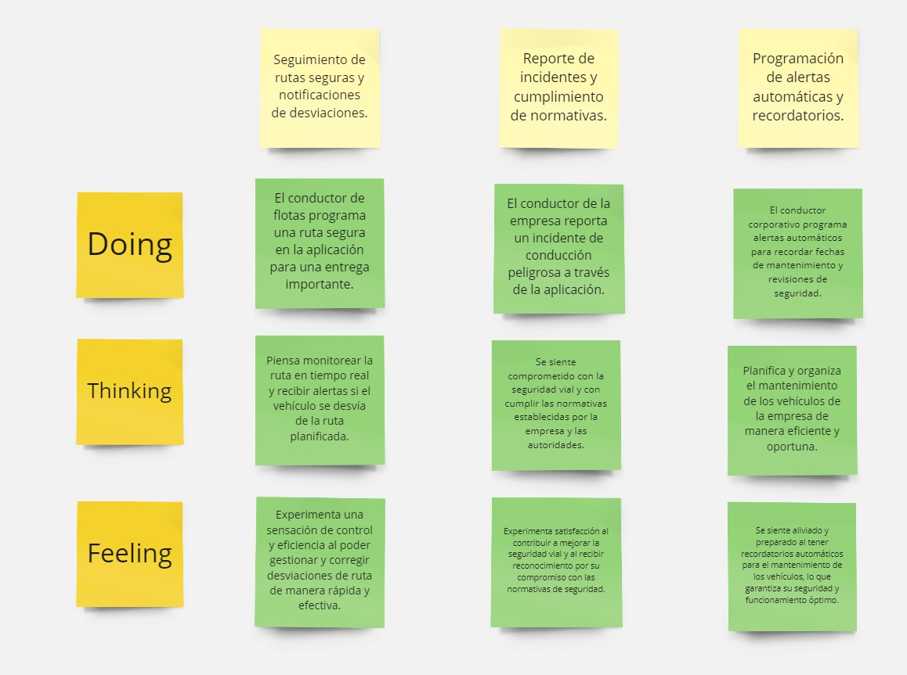

# Capítulo III: Requirements Specification
La especificación de requisitos será una etapa crucial en nuestro trabajo, ya que nos permitirá definir claramente los objetivos y las funcionalidades que nuestro producto debe cumplir.

## **3.1. To-Be Scenario Mapping.**
El mapeo de escenarios "To-Be" nos permite visualizar cómo será el proceso o flujo de trabajo deseado en el futuro después de implementar las mejoras propuestas. Nos ayuda a identificar los cambios necesarios en los procesos actuales y a diseñar soluciones para optimizarlos. Al crear escenarios "To-Be", podemos visualizar claramente cómo se verá el proceso una vez que se implementen las mejoras, lo que nos permite comunicar mejor la visión del proyecto y alinear a todas las partes interesadas en torno a los objetivos comunes. Esto facilita la planificación y la implementación efectiva de los cambios para lograr los resultados deseados.
  
Segmento Objetivo:
Taxistas que buscan soluciones para asegurar el estacionamiento y proteger sus vehículos de robos frecuentes

 

Segmento Objetivo:
Jóvenes entre 18-25 años

[URL_MIRO](https://miro.com/app/board/uXjVKVGaRnU=/#tpicker-content)
URL: https://miro.com/app/board/uXjVKVGaRnU=/#tpicker-content

# **3.2 User Stories**
Las User Stories, o historias de usuario, son descripciones breves y centradas en el usuario de una funcionalidad específica del producto. Nos ayudan a comprender las necesidades y expectativas de nuestros usuarios al abordar qué quieren lograr y por qué. Al escribir User Stories, nos centramos en el valor que proporcionará la funcionalidad para el usuario y en cómo la utilizará en su contexto. Esto nos permite priorizar las características del producto de acuerdo con su importancia para el usuario y desarrollar soluciones que realmente resuelvan sus problemas y satisfagan sus necesidades.
 

<table><tr><th valign="top">Epic/User Story ID</th><th valign="top">Título</th><th valign="top">Descripción</th><th valign="top">Criterios de aceptación</th><th valign="top">Relacionado con (Epic ID)</th></tr>
<tr><td valign="top">

HU1
</td><td valign="top">

Protección contra robos y alertas de seguridad.

</td><td valign="top">Como joven conductor, quiero activar la función de seguridad en la aplicación para proteger mi automóvil contra robos y recibir alertas instantáneas en caso de actividad sospechosa.</td><td valign="top">
Dado que estoy estacionando mi automóvil,

Cuando activo la función de seguridad en la aplicación,

Entonces la aplicación detecta movimientos no autorizados y envía una alerta instantánea a mi dispositivo móvil.

</td><td rowspan="2" valign="top">

Epic 1
</td></tr>
<tr><td valign="top">

HU2
</td><td valign="top">
 

Geolocalización y rastreo en tiempo real.
</td><td valign="top">Como conductor joven, quiero utilizar la función de geolocalización en la aplicación para rastrear la ubicación de mi vehículo en tiempo real y compartir esa información si es necesario.</td><td valign="top">
Dado que inicio mi viaje,

Cuando activo la función de geolocalización en la aplicación,

Entonces puedo ver la ubicación en tiempo real de mi automóvil en un mapa y compartir esta información con contactos específicos.

</td></tr>
<tr><td valign="top">

HU3
</td><td valign="top">

Recomendaciones personalizadas de seguridad.

</td><td valign="top">Como propietario de un automóvil, quiero recibir recomendaciones personalizadas sobre medidas de seguridad adicionales según las áreas de alto riesgo de robo en mi área.</td><td valign="top">
Dado que recibo notificaciones sobre áreas de alto riesgo de robo,

Cuando la aplicación sugiere medidas de seguridad adicionales,

Entonces puedo acceder a las recomendaciones y seguir las medidas sugeridas para proteger mi vehículo.

</td><td rowspan="2" valign="top">

Epic2

</td></tr>
<tr><td valign="top">

HU4
</td><td valign="top">

Reporte de incidentes de seguridad.

</td><td valign="top">Como conductor joven, quiero tener la capacidad de reportar incidentes de seguridad vial a través de la aplicación para contribuir a la seguridad de la comunidad.</td><td valign="top">
Dado que presenció un incidente de seguridad vial,

Cuando uso la función de reporte en la aplicación,

Entonces mi reporte se envía a las autoridades pertinentes para su evaluación y acción.

</td></tr>
<tr><td valign="top">

HU5
</td><td valign="top">

Compartir ubicación con contactos de confianza.
</td><td valign="top">Como conductor joven, quiero poder compartir mi ubicación en tiempo real con contactos de confianza a través de la aplicación para garantizar mi seguridad..</td><td valign="top">
Dado que quiero compartir mi ubicación,

Cuando selecciono contactos de confianza en la aplicación,

Entonces ellos pueden ver mi ubicación en tiempo real mientras conduzco.

</td><td rowspan="2" valign="top">

Epic 3
</td></tr>
<tr><td valign="top">

HU6
</td><td valign="top">

Asistencia en caso de accidente.
</td><td valign="top">Como conductor joven, quiero tener acceso rápido a servicios de asistencia en caso de accidente a través de la aplicación para recibir ayuda adecuada.</td><td valign="top">
Dado que tengo un accidente,

Cuando uso la función de asistencia en la aplicación,

Entonces la aplicación notifica a servicios de emergencia y contactos de emergencia predeterminados.

.

</td></tr>
<tr><td valign="top">

HU7
</td><td valign="top">Programación de recordatorios de mantenimiento.</td><td valign="top">Como conductor joven, quiero programar recordatorios de mantenimiento de mi vehículo en la aplicación para mantenerlo en óptimas condiciones.</td><td valign="top">
Dado que deseo recordatorios de mantenimiento,

Cuando programo fechas y detalles de mantenimiento en la aplicación,

Entonces recibo notificaciones cuando se acerque la fecha de mantenimiento.
</td><td rowspan="2" valign="top">

Epic 4
</td></tr>
<tr><td valign="top">

HU8
</td><td valign="top">

Registro de gastos de combustible y mantenimiento.
</td><td valign="top">Como conductor joven, quiero registrar mis gastos de combustible y mantenimiento en la aplicación para tener un registro organizado de los mismos.</td><td valign="top">
Dado que necesito registrar mis gastos,

Cuando ingreso los detalles de combustible y mantenimiento en la aplicación,

Entonces la aplicación genera informes detallados de mis gastos.
</td></tr>
<tr><td valign="top">

HU9
</td><td valign="top">

Evaluación de conducción y sugerencias de mejora.
</td><td valign="top">Como conductor joven, quiero recibir evaluaciones de mi estilo de conducción y sugerencias de mejora a través de la aplicación para conducir de manera más segura.</td><td valign="top">
Dado que quiero mejorar mi conducción,

Cuando la aplicación analiza mi estilo de conducción y genera recomendaciones,

Entonces puedo seguir las sugerencias para mejorar mis habilidades al volante.
</td><td rowspan="2" valign="top">

Epic 5
</td></tr>
<tr><td valign="top">

HU10
</td><td valign="top">

Recordatorios de límites de velocidad y normativas viales.
</td><td valign="top">Como conductor joven, quiero recibir recordatorios de límites de velocidad y normativas viales en tiempo real para conducir de manera responsable.</td><td valign="top">
Dado que deseo conducir dentro de los límites,

Cuando la aplicación detecta que estoy cerca de superar un límite de velocidad o infringo una normativa vial,

Entonces recibo una alerta y un recordatorio visual en la aplicación.
</td></tr>
<tr><td valign="top">

HU11
</td><td valign="top">

Comunicación con servicios de estacionamiento.
</td><td valign="top">Como conductor joven, quiero poder comunicarme con servicios de estacionamiento a través de la aplicación para obtener información sobre disponibilidad y tarifas.</td><td valign="top">
Dado que necesito estacionamiento,

Cuando uso la función de comunicación con servicios de estacionamiento en la aplicación,

Entonces puedo obtener información actualizada sobre disponibilidad, ubicación y tarifas de estacionamiento.
</td><td rowspan="2" valign="top">

Epic 6

</td></tr>
<tr><td valign="top">

HU12
</td><td valign="top">

Información sobre rutas alternativas en tiempo real.
</td><td valign="top">Como conductor joven, quiero recibir información sobre rutas alternativas en tiempo real a través de la aplicación para evitar congestiones y llegar más rápido a mi destino.</td><td valign="top">
Dado que deseo evitar el tráfico,

Cuando la aplicación detecta congestiones en mi ruta planificada y sugiere rutas alternativas,

Entonces puedo elegir una ruta más eficiente y llegar a mi destino más rápido.
</td></tr>
<tr><td valign="top">

HU13
</td><td valign="top">

Gestión de perfiles de conductores múltiples.
</td><td valign="top">Como conductor joven, quiero poder gestionar múltiples perfiles de conductores en la aplicación para compartir mi vehículo con otros conductores de confianza.</td><td valign="top">
Dado que tengo varios conductores para un mismo vehículo,

Cuando configuro perfiles individuales en la aplicación,

Entonces cada conductor puede acceder a su perfil y configuración personalizada.
</td><td rowspan="3" valign="top">

Epic 7

</td></tr>
<tr><td valign="top">

HU14
</td><td valign="top">

Integración con servicios de seguros automotrices.
</td><td valign="top">Como conductor joven, quiero integrar la aplicación con servicios de seguros automotrices para gestionar mis pólizas y recibir asistencia en caso de reclamos.</td><td valign="top">
Dado que quiero gestionar mi seguro automotriz,

Cuando integro la aplicación con mi proveedor de seguros y accedo a mis pólizas y servicios,

Entonces puedo recibir asistencia y realizar trámites relacionados con mi seguro directamente desde la aplicación.
</td></tr>
<tr><td valign="top">

HU15
</td><td valign="top">Sincronización de recordatorios con calendarios externos.</td><td valign="top">Como conductor joven, quiero que los recordatorios de la aplicación se sincronicen con mi calendario externo para no perder ninguna fecha importante relacionada </td><td valign="top">
Dado que uso un calendario externo,

Cuando programo recordatorios en la aplicación,

Entonces los recordatorios se sincronizan automáticamente con mi calendario para recibir notificaciones en tiempo y forma.
</td></tr>
<tr><td valign="top">

HU16
</td><td valign="top">

Alertas de seguridad y gestión de flotas.
</td><td valign="top">Como conductor corporativo, quiero recibir alertas en tiempo real sobre intentos de robo en el vehículo de la empresa y poder gestionar eficientemente la seguridad de la flota.</td><td valign="top">
Dado que recibo alertas sobre intentos de robo en tiempo real,

Cuando accedo a la ubicación en tiempo real de los vehículos de la flota,

Entonces puedo gestionar la seguridad de la flota y tomar medidas apropiadas según la situación.
</td><td valign="top">

Epic 8
</td></tr>
<tr><td valign="top">

HU17
</td><td valign="top">

Seguimiento de rutas seguras y notificaciones de desviaciones.

</td><td valign="top">Como conductor de flotas, quiero programar rutas seguras en la aplicación y recibir alertas si un vehículo se desvía de esas rutas planificadas.</td><td valign="top">
Dado que programo una ruta segura en la aplicación,

Cuando un vehículo se desvía de la ruta planificada,

Entonces recibo una alerta y puedo tomar medidas para corregir la desviación.
</td><td rowspan="2" valign="top">

Epic 9
</td></tr>
<tr><td valign="top">

HU18
</td><td valign="top">

Registro de kilometraje y consumo de combustible.
</td><td valign="top">Como conductor de empresa, quiero registrar el kilometraje y el consumo de combustible de los vehículos de la flota en la aplicación para realizar un seguimiento eficiente de los mismos.</td><td valign="top">
Dado que necesito registrar el kilometraje y consumo de combustible,

Cuando ingreso los datos en la aplicación,

Entonces la aplicación genera informes detallados y gráficos para analizar el rendimiento de los vehículos.
</td></tr>
<tr><td valign="top">HU19</td><td valign="top">Programación de mantenimientos preventivos.</td><td valign="top">Como conductor de flotas, quiero programar mantenimientos preventivos para los vehículos de la empresa en la aplicación para garantizar su buen estado y durabilidad</td><td valign="top">
Dado que necesito mantener los vehículos en buen estado,

Cuando programo mantenimientos preventivos en la aplicación,

Entonces la aplicación genera recordatorios y alertas para recordar los mantenimientos planificados.
</td><td rowspan="2" valign="top">

Epic 10

</td></tr>
<tr><td valign="top">HU20</td><td valign="top">Monitoreo de comportamientos de conducción.</td><td valign="top">Como conductor de empresa, quiero monitorear los comportamientos de conducción de los empleados a través de la aplicación para fomentar una conducción segura y eficiente.</td><td valign="top">
Dado que necesito monitorear comportamientos de conducción,

Cuando accedo a los informes de conducción en la aplicación,

Entonces puedo ver métricas como velocidad, frenado brusco, aceleración agresiva, y recibir alertas sobre comportamientos inseguros.
</td></tr>
<tr><td valign="top">HU21</td><td valign="top">Integración con sistemas de gestión de flotas.</td><td valign="top">Como administrador de flotas, quiero integrar la aplicación con sistemas de gestión de flotas existentes para tener una visión completa y centralizada de la operación.</td><td valign="top">
Dado que utilizamos un sistema de gestión de flotas,

Cuando integro la aplicación con este sistema,

Entonces la información se sincroniza automáticamente y puedo acceder a datos actualizados en tiempo real.
</td><td rowspan="3" valign="top">

Epic 11
</td></tr>
<tr><td valign="top">HU22</td><td valign="top">Registro de historial de mantenimientos y reparaciones.</td><td valign="top">Como conductor de empresa, quiero mantener un registro detallado del historial de mantenimientos y reparaciones de los vehículos en la aplicación para tener un mantenimiento adecuado.</td><td valign="top">
Dado que necesito un historial de mantenimientos y reparaciones,

Cuando registro cada mantenimiento o reparación en la aplicación,

Entonces la información se guarda de manera organizada y accesible para referencia futura.
</td></tr>
<tr><td valign="top">HU23</td><td valign="top">Asignación de vehículos y programación de viajes.</td><td valign="top">Como administrador de flotas, quiero poder asignar vehículos a conductores específicos y programar viajes en la aplicación para una gestión eficiente de los recursos.</td><td valign="top">
Dado que necesito asignar vehículos y programar viajes,

Cuando realizo asignaciones y programo viajes en la aplicación,

Entonces la información se actualiza en tiempo real y los conductores reciben notificaciones sobre sus asignaciones y viajes programados.
</td></tr>
<tr><td valign="top">HU24</td><td valign="top">Análisis de eficiencia y optimización de rutas.</td><td valign="top">Como administrador de flotas, quiero analizar la eficiencia de las rutas de los vehículos y optimizarlas en la aplicación para reducir costos operativos y tiempos de viaje</td><td valign="top">
Dado que necesito optimizar rutas,

Cuando accedo a análisis de eficiencia y sugerencias de optimización en la aplicación,

Entonces puedo tomar decisiones informadas para mejorar la eficiencia de las operaciones de la flota.
</td><td valign="top">

Epic 12
</td></tr>
<tr><td valign="top">HU25</td><td valign="top">Seguimiento de horarios y cumplimiento de itinerarios.</td><td valign="top">Como conductor de empresa, quiero tener un seguimiento de horarios y cumplimiento de itinerarios en la aplicación para mantener una operación puntual y eficiente.</td><td valign="top">
Dado que necesito cumplir horarios y itinerarios,

Cuando accedo a mi horario y itinerario en la aplicación,

Entonces recibo recordatorios y notificaciones sobre tareas pendientes y tiempos de llegada estimados.
</td><td rowspan="2" valign="top">

Epic 13
</td></tr>
<tr><td valign="top">HU26</td><td valign="top">Gestión de incidentes y reclamos de seguros</td><td valign="top">Como conductor de flotas, quiero poder gestionar incidentes y reclamos de seguros directamente desde la aplicación para agilizar el proceso y minimizar interrupciones en la operación.</td><td valign="top">
Dado que puedo tener incidentes en la carretera,

Cuando reporto un incidente y gestiono reclamos de seguros en la aplicación,

Entonces la aplicación facilita el proceso de reclamo y seguimiento hasta su resolución.
</td></tr>
<tr><td valign="top">HU27</td><td valign="top">Integración con sistemas de seguimiento de conductores.</td><td valign="top">Como administrador de flotas, quiero integrar la aplicación con sistemas de seguimiento de conductores para tener una visión completa del desempeño y seguridad de los conductores.</td><td valign="top">
Dado que utilizamos sistemas de seguimiento de conductores,

Cuando integro la aplicación con estos sistemas,

Entonces puedo acceder a datos detallados sobre el comportamiento de conducción y la ubicación en tiempo real de los conductores.
</td><td rowspan="2" valign="top">

Epic 14
</td></tr>
<tr><td valign="top">HU28</td><td valign="top">Reportes de gastos operativos y análisis financiero.</td><td valign="top">Como administrador de flotas, quiero generar reportes detallados de gastos operativos y realizar análisis financiero en la aplicación para mejorar la eficiencia y reducir costos.</td><td valign="top">
Dado que necesito información financiera y análisis,

Cuando genero reportes de gastos operativos y realizo análisis financiero en la aplicación,

Entonces obtengo insights clave para la toma de decisiones estratégicas.
</td></tr>
<tr><td valign="top">HU29</td><td valign="top">Comunicación interna y mensajes urgentes.</td><td valign="top">Como conductor de flotas, quiero tener una comunicación interna fluida y recibir mensajes urgentes en la aplicación para estar informado y responder rápidamente a situaciones críticas.</td><td valign="top">
Dado que necesito comunicación interna,

Cuando recibo mensajes y comunicados en la aplicación,

Entonces puedo responder rápidamente y colaborar de manera efectiva con el equipo.
</td><td rowspan="2" valign="top">

Epic 15

</td></tr>
<tr><td valign="top">HU30</td><td valign="top">Integración con sistemas de gestión de inventarios.</td><td valign="top">Como administrador de flotas, quiero integrar la aplicación con sistemas de gestión de inventarios para tener un control preciso de repuestos y accesorios para los vehículos.</td><td valign="top">
Dado que gestionamos inventarios de repuestos y accesorios,

Cuando integro la aplicación con sistemas de gestión de inventarios,

Entonces puedo realizar seguimiento de existencias, pedidos y movimientos de inventario de manera eficiente desde la aplicación.
</td></tr>
<tr><td valign="top">HU31</td><td valign="top">Acceso rápido al perfil desde la página de inicio.</td><td valign="top">Como usuario registrado, deseo tener un acceso fácil y rápido a mi perfil desde la página de inicio, para poder gestionar mis datos personales, configuraciones y preferencias de forma conveniente.</td><td valign="top">
Dado que el usuario carga la página de inicio.,

Cuando observe la página, debe haber un enlace o botón claramente visible para acceder al perfil del usuario,

Al hacer clic en el enlace o botón de perfil, el usuario debe ser redirigido de manera rápida y sin problemas a su perfil.
</td><td rowspan="2" valign="top">

Epic 17

</td></tr>
<tr><td valign="top">HU32</td><td valign="top">Registro de usuarios desde la página de inicio</td><td valign="top">Como usuario interesado en utilizar los servicios del proyecto, deseo poder registrarme desde la página de inicio para comenzar a utilizar las funcionalidades disponibles.</td><td valign="top">
Dado que el usuario carga la página de inicio,

Cuando vea un botón o enlace de "Registro" en la página de inicio,

Al hacer clic en el botón de registro, el usuario debe ser llevado a un formulario de registro.
Después de completar el formulario, el usuario debe recibir una confirmación de registro exitoso.
</td></tr>
<tr><td valign="top">HU33</td><td valign="top">Acceso a la sección de preguntas frecuentes desde la página de inicio</td><td valign="top">Como usuario interesado en obtener respuestas rápidas a preguntas comunes, deseo poder acceder fácilmente a la sección de preguntas frecuentes (FAQ) desde la página de inicio.</td><td valign="top">
Dado que el usuario carga la página de inicio,

Cuando vea un enlace o botón claramente visible para acceder a la sección de preguntas frecuentes,

Al hacer clic en el enlace, el usuario debe ser llevado directamente a la sección de preguntas frecuentes con respuestas detalladas.
</td><td rowspan="2" valign="top">

Epic 18

</td></tr>
</table>

# **3.3 IMPACT MAPPING**
Impact Mapping es una herramienta poderosa que nos ayudará a visualizar y planificar cómo nuestro proyecto puede generar un impacto significativo en nuestros usuarios y en nuestro objetivo final. Asimismo, nos permitirá identificar claramente los resultados deseados, los comportamientos esperados de nuestros usuarios y las acciones necesarias para alcanzar esos objetivos. Al utilizar Impact Mapping, podremos alinear mejor nuestras actividades con nuestros objetivos, tomar decisiones más informadas y maximizar el impacto de nuestro proyecto.
  
Segmento 1: Taxistas que buscan soluciones para asegurar el estacionamiento y proteger sus vehículos de robos frecuentes

 

Segmento 2: Jóvenes entre 18-25 años 

 

MIRO LINK : <https://miro.com/app/board/uXjVKXzElHA=/#tpicker-content>

# **3.4 PRODUCT BACKLOG**
El Product Backlog es una lista dinámica y priorizada de todas las características, funcionalidades, mejoras y correcciones que se planea incluir en el producto. Nos ayuda a mantener un registro organizado de todo lo que se desea implementar, permitiéndonos priorizar de manera efectiva las tareas según su importancia y valor para el cliente. Esto nos permite tener una visión clara y actualizada de lo que se debe hacer en el proyecto, lo que facilita la planificación, el seguimiento y la toma de decisiones durante el desarrollo del producto.
 

**Product Backlog:**

|         #Orden          |User Story ID|Título|                                                                                        Descripción                                                                                        |Story Points (1/2/3/5/8)|
|:-----------------------:| :-: | :-: |:-----------------------------------------------------------------------------------------------------------------------------------------------------------------------------------------:| :-: |
|            1            ||Geolocalización y rastreo en tiempo real.|Como conductor joven, quiero utilizar la función de geolocalización en la aplicación para rastrear la ubicación de mi vehículo en tiempo real y compartir esa información si es necesario. |8|
|            2            ||Registro de usuarios desde la página de inicio|        Como usuario interesado en utilizar los servicios del proyecto, deseo poder registrarme desde la página de inicio para comenzar a utilizar las funcionalidades disponibles.        |8|
|            3            ||Integración con servicios de seguros automotrices.|              Como conductor joven, quiero integrar la aplicación con servicios de seguros automotrices para gestionar mis pólizas y recibir asistencia en caso de reclamos.               |8|
|            4            ||Alertas de seguridad y gestión de flotas.|     Como conductor corporativo, quiero recibir alertas en tiempo real sobre intentos de robo en el vehículo de la empresa y poder gestionar eficientemente la seguridad de la flota.      |8|
|            5            ||Monitoreo de comportamientos de conducción.|        Como conductor de empresa, quiero monitorear los comportamientos de conducción de los empleados a través de la aplicación para fomentar una conducción segura y eficiente.         |8|
|            6            ||Análisis de eficiencia y optimización de rutas.|        Como administrador de flotas, quiero analizar la eficiencia de las rutas de los vehículos y optimizarlas en la aplicación para reducir costos operativos y tiempos de viaje        |8|
|     

7
     |

|Gestión de incidentes y reclamos de seguros.|  Como conductor de flotas, quiero poder gestionar incidentes y reclamos de seguros directamente desde la aplicación para agilizar el proceso y minimizar interrupciones en la operación.  |8|
|     

8
     |

|Integración con sistemas de seguimiento de conductores.|    Como administrador de flotas, quiero integrar la aplicación con sistemas de seguimiento de conductores para tener una visión completa del desempeño y seguridad de los conductores.    |8|
| 

9
  |

|

Protección contra robos y alertas de seguridad.
|   Como conductor joven, quiero activar la función de seguridad en la aplicación para proteger mi automóvil contra robos y recibir alertas instantáneas en caso de actividad sospechosa.   |5|
| 

10
 |

|

Acceso rápido al perfil desde la página de inicio
|  Como usuario registrado, deseo tener un acceso fácil y rápido a mi perfil desde la página de inicio, para poder gestionar mis datos personales, configuraciones y preferencias de forma conveniente.|5|
|    

11
     |

|

Reporte de incidentes de seguridad.
|            Como conductor joven, quiero tener la capacidad de reportar incidentes de seguridad vial a través de la aplicación para contribuir a la seguridad de la comunidad.             |

5
|
|    

12
     |

|Asistencia en caso de accidente.|                  Como conductor joven, quiero tener acceso rápido a servicios de asistencia en caso de accidente a través de la aplicación para recibir ayuda adecuada.                   |5|
|    

13
     |

|
Evaluación de conducción y sugerencias de mejora.

|            Como conductor joven, quiero recibir evaluaciones de mi estilo de conducción y sugerencias de mejora a través de la aplicación para conducir de manera más segura.             |5|
|    

14
     |

|Información sobre rutas alternativas en tiempo real|     ` `Como conductor joven, quiero recibir información sobre rutas alternativas en tiempo real a través de la aplicación para evitar congestiones y llegar más rápido a mi destino.      |5|
|    

15
     |

|

Gestión de perfiles de conductores múltiples
|              Como conductor joven, quiero poder gestionar múltiples perfiles de conductores en la aplicación para compartir mi vehículo con otros conductores de confianza.               |5|
|    

16
     |

|

Seguimiento de rutas seguras y notificaciones de desviaciones.
|                     Como conductor de flotas, quiero programar rutas seguras en la aplicación y recibir alertas si un vehículo se desvía de esas rutas planificadas.                      |5|
| 

17
 |

|

Programación de mantenimientos preventivos.
|           Como conductor de flotas, quiero programar mantenimientos preventivos para los vehículos de la empresa en la aplicación para garantizar su buen estado y durabilidad            |5|
|    

18
     |

|

Integración con sistemas de gestión de flotas.
|          Como administrador de flotas, quiero integrar la aplicación con sistemas de gestión de flotas existentes para tener una visión completa y centralizada de la operación.          |5|
|    

19
     |

|Asignación de vehículos y programación de viajes.|          Como administrador de flotas, quiero poder asignar vehículos a conductores específicos y programar viajes en la aplicación para una gestión eficiente de los recursos.           |5|
|    

20
     |

|

Seguimiento de horarios y cumplimiento de itinerarios.
|            Como conductor de empresa, quiero tener un seguimiento de horarios y cumplimiento de itinerarios en la aplicación para mantener una operación puntual y eficiente.             |5|
|    

21
     |

|

Reportes de gastos operativos y análisis financiero.
|    Como administrador de flotas, quiero generar reportes detallados de gastos operativos y realizar análisis financiero en la aplicación para mejorar la eficiencia y reducir costos.     |5|
|    

22
     |

|Integración con sistemas de gestión de inventarios.|      Como administrador de flotas, quiero integrar la aplicación con sistemas de gestión de inventarios para tener un control preciso de repuestos y accesorios para los vehículos.       |5|
|    

23
     |

|Recomendaciones personalizadas de seguridad.|         Como propietario de un automóvil, quiero recibir recomendaciones personalizadas sobre medidas de seguridad adicionales según las áreas de alto riesgo de robo en mi área.         |3|
|    

24
     |

|

Compartir ubicación con contactos de confianza
|                Como conductor joven, quiero poder compartir mi ubicación en tiempo real con contactos de confianza a través de la aplicación para garantizar mi seguridad.                |3|
|    

25
     |

|Programación de recordatorios de mantenimiento.|                       Como conductor joven, quiero programar recordatorios de mantenimiento de mi vehículo en la aplicación para mantenerlo en óptimas condiciones.                       |3|
|    

26
     |

|

Registro de gastos de combustible y mantenimiento.
|                    Como conductor joven, quiero registrar mis gastos de combustible y mantenimiento en la aplicación para tener un registro organizado de los mismos.                     |3|
|    

27
     |

|

Recordatorios de límites de velocidad y normativas viales.
|                    Como conductor joven, quiero recibir recordatorios de límites de velocidad y normativas viales en tiempo real para conducir de manera responsable.                     |3|
|    

28
     |

|Comunicación con servicios de estacionamiento.|            Como conductor joven, quiero poder comunicarme con servicios de estacionamiento a través de la aplicación para obtener información sobre disponibilidad y tarifas.             |3|
| 

29
 |

|

Registro de kilometraje y consumo de combustible.
|Como conductor de empresa, quiero registrar el kilometraje y el consumo de combustible de los vehículos de la flota en la aplicación para realizar un seguimiento eficiente de los mismos. |3|
|           30            ||Registro de historial de mantenimientos y reparaciones.|  Como conductor de empresa, quiero mantener un registro detallado del historial de mantenimientos y reparaciones de los vehículos en la aplicación para tener un mantenimiento adecuado.  |3|
|    

31
     |

|

Comunicación interna y mensajes urgentes.

|` `Como conductor de flotas, quiero tener una comunicación interna fluida y recibir mensajes urgentes en la aplicación para estar informado y responder rápidamente a situaciones críticas.|3|
|    

32
     |

|

Acceso a la sección de preguntas frecuentes desde la página de inicio

|` `Como usuario interesado en obtener respuestas rápidas a preguntas comunes, deseo poder acceder fácilmente a la sección de preguntas frecuentes (FAQ) desde la página de inicio.|3|
|    

33
     ||Sincronización de recordatorios con calendarios externos.|     Como conductor joven, quiero que los recordatorios de la aplicación se sincronicen con mi calendario externo para no perder ninguna fecha importante relacionada con mi vehículo.     |2|

