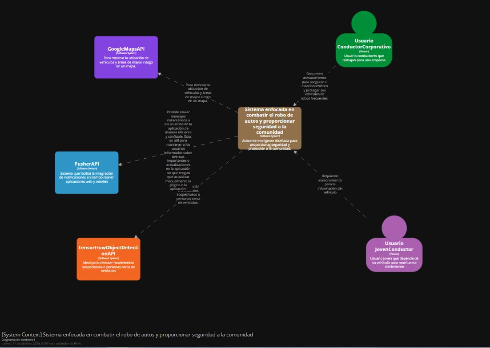
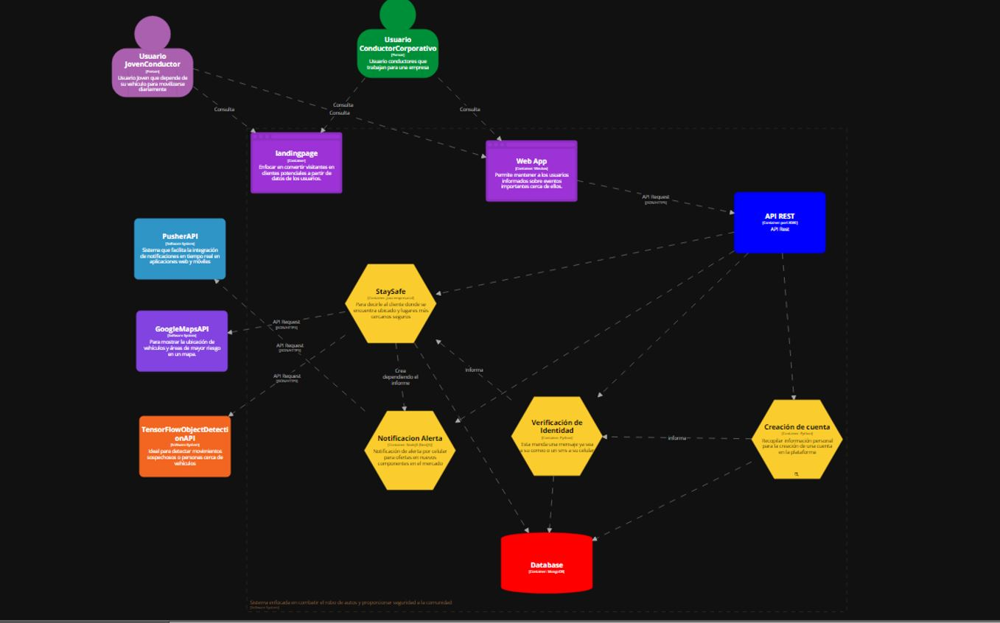
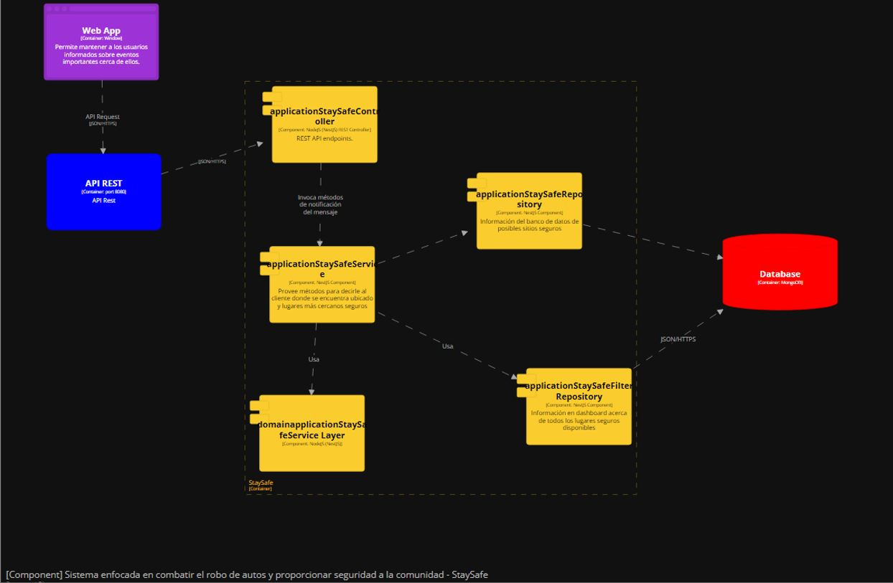
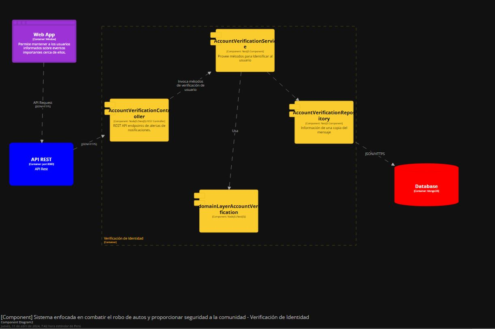
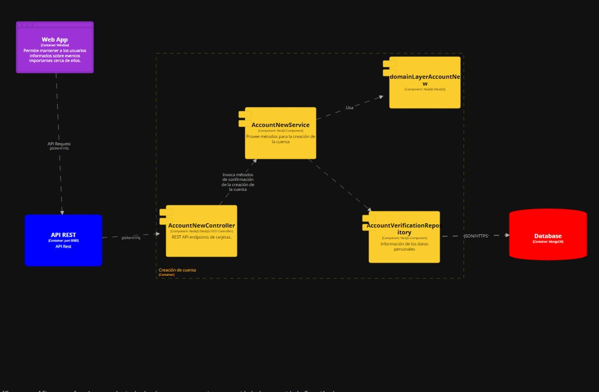
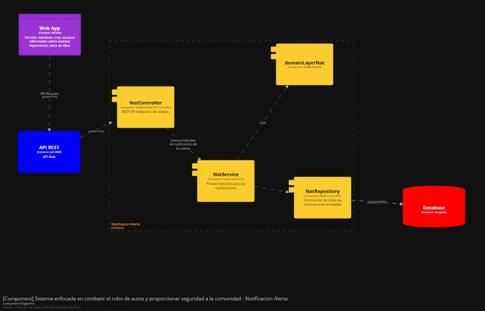

## **Capítulo IV: Product Design
### 4.1. Style Guidelines.
#### 4.1.1. General Style Guidelines.
**Branding** 
En este caso se decidio que el icono de la aplicación tenga un diseño sencillo. El fondo es de color lila, con una línea de un tono más claro que atraviesa el fondo, seguida por una tonalidad gradualmente más oscura de lila. Además se usó un logo representativo, un auto dentro de un escudo que se da a entender que buscamos proteger la seguridad del coche. 

 

**Typography**
Se escogió esta tipografía debido a que proyecta simplicidad, y un toque moderno el cual creemos que encaja con nuestro proyecto.

 

**Colors**

 

**Spacing**

 

En este caso el tono de comunicación elegido, por la naturaleza de la aplicación, será serio, formal y sereno.

**Components**
Además de los anteriores, decidimos agregar algunos componentes que nos ayudarán a la elaboración del landing page. 
 

#### 4.1.2. Web Style Guidelines.

Responsive Web Interface 
 

El contenido que se prioriza son Ofrecemos, Ubicación, y beneficios, ya que, la prevención es nuestro objetivo principal.

Los valores de espaciado son múltiplos de 4px, además, el contraste de colores, el tamaño del texto y alineación elegida permiten una lectura legible del texto. La tipografía permite una clara diferenciación del título, a su vez del estilo anteriormente descrito, siendo sereno y serio.

Las imágenes usadas son de licencia libre y guardan relación con el objetivo de la aplicación. Se escogió un degradado como fondo de pantalla por su simplicidad y estética.

La tendencia web escogida fue de degradado y se optó por el patrón de diseño F, estas decisiones fueron tomadas con el objetivo de generar la mayor cantidad de interés en el espectador para así lograr que se interesen en nuestra aplicación.

### 4.2. Information Architecture.
#### 4.2.1. Organization Systems.
El propósito del sistema de organización de la página es establecer la estructura visual del contenido y la navegación en la misma. En el caso de SecurCar , el esquema de organización de contenido se divide en módulos y se enfoca en los siguientes temas:

**HOMEPAGE** 
 

En la parte superior de la página principal se encuentran las opciones que conducen a otras secciones, ya que al seguir un patrón de diseño F, se busca enfatizar la importancia de que el usuario conozca la empresa y todo lo que la página tiene para ofrecer, para finalmente poder registrarse o iniciar sesión, lo cual se encuentra representado por los botones en el extremo derecho. Además se muestra un botón de modo oscuro y finalmente se puede visualizar en la esquina derecha "Español/English" que tiene como función cambiar el idioma de la página.

**UBICACIÓN**

La función de esta sección es llamar la atención de la que es nuestra principal función que es un dispositivo que mostrará la ubicación del vehículo en el cual se encuentre.

**OFRECEMOS**

En esta sección deseamos mostrar todas las funciones que estamos ofreciendo, en este caso son: Un dispositivo rastreador, Ayuda a los principiantes por medio de consejos, Avisos de caducidad. Cada uno con su respectivo botón de "More" para que los usuarios accedan a una información más detallada.

**BENEFICIOS**

En esta sección mostramos los beneficios que traen consigos las features anteriormente mencionadas, como pueden ser, estar más alerta de los robos y prevenirlos; tener los papeles en orden y estar al tanto de estos; y finalmente consejos viales que les servira.

**Registro usuario**
Se han tomado en cuenta dos pantallas para el módulo de registro de usuario: Landing page y Registro. En la pantalla de Registro, se priorizarán los datos esenciales para crear una cuenta, como nombres, apellidos, correo electrónico y contraseña. La organización visual de contenido se realizará de manera jerárquica, colocando estos datos prioritarios en la parte superior de la pantalla. 

#### 4.2.2. Labeling Systems.

Para el sistema de mensajes de error y ayuda, se utilizará un método de resaltado del cuadro de texto en rojo cuando se ingrese un carácter no permitido. Si se envía la información sin corregir el error, aparecerá una ventana emergente que indicará el error cometido y se proporcionará la opción "listo" para volver al formulario. En la página web o aplicación, se indicará el error cometido y se señalará lo que debe corregirse (como ingresar un carácter no permitido o proporcionar información faltante).  

#### 4.2.3. SEO Tags and Meta Tags
En este caso se manejarán diversas páginas, como podrían ser Inicio, Inscripción de vehículo, Papeles, Consejos.
1. Landing Page
- Title Tag: Bienvenida | SecurCar 
- Meta Description Tag: Content: "Pagina de inicio de Securcar"
- Meta Keyword Tag: Content: SecurCar, Rastreador de vehículo, Pagina principal
- Author: SecurCar
2. Home
- Title Tag: Inicio | SecurCar
- Meta Description Tag: Content: "Pagina principal de SecurCar"
- Meta Keyword Tag: Content: SecurCar, Pagina Principal, 
- Author: SecurCar Group
3. Inscripcion de Vehículo
- Title Tag: Incripción de Vehículo | SecurCar
- Meta Description Tag: Content: "Registre su vehículo"
- Meta Keyword Tag: Content: SecurCar, Registro de vehículo de Vehiculo, Inscripción de vehículo, 
- Author: SecurCar Group
4. Papeles
- Title Tag: Papeles de Vehículo | Securcar
- Meta Description Tag: Content: "Tenga todos los papeles en orden en un solo lugar"
- Meta Keyword Tag: Content: SecurCar, Guardar papeles Securcar, Cuando vence SecurCar, Ver Papeles SecurCar
- Author: SecurCar Group
5. Consejos
- Title Tag: Consejos | SecurCar
- Meta Description Tag: Content: "Reciba consejos de Seguridad Vial"
- Meta Keyword Tag: Content: SecurCar, Consejos SecurCar
- Author: Securcar Group
#### 4.2.4. Searching Systems.
Dividido en puntos:
1. Barra de Navegación Principal:
En la parte superior de la página se encuentra una barra de navegación que incluye enlaces a las secciones principales del sitio.
Los enlaces principales son: "Página Principal", "Acerca de Nosotros", "Ubicación", "Ofrecemos", "Beneficios" y "Contacto".

2. Navegación Jerárquica:
La página principal sigue un patrón de diseño F, lo que enfatiza la importancia de que el usuario conozca la empresa y lo que ofrece.
Las opciones de navegación están jerárquicamente organizadas, con las secciones más importantes y relevantes en la parte superior.

3. Enlaces Contextuales:
Dentro de cada sección, se incluyen botones que guían al usuario a contenido relacionado o información relevante. Un ejemplo de esto se puede dar en la sección "Ubicación" en la cual al presionar el botón "More" se abrira una ventana en la cual se explique a mayor detalle información relevante para el usuario.

4. Navegación secuencial
En el proceso de registro de usuario, se utiliza una navegación secuencial donde se guía al usuario paso a paso a través del proceso de creación de cuenta.

5. Sección Inferior:
En la parte inferior de la página, se incluye una navegación adicional que proporciona acceso rápido a información importante y complementaria, como "Contáctanos.

#### 4.2.5. Navigation Systems.

Utilizaremos un sistema de navegación conocido como "Hamburger Menu" que consiste en un panel izquierdo de navegación. Este panel nos permitirá aplicar filtros y subfiltros durante la búsqueda, lo que nos ayudará a organizar y presentar varias opciones de navegación de forma clara y concisa, manteniendo así la aplicación ordenada y fácil de usar.
Asimismo se usará la barra de búsqueda para que las personas busquen sus necesidades. 

### 4.3. Landing Page UI Design.
En este caso se diseño de esta debido a su simplicidad, con colores claros como el verde, debido a que representa bien nuestra búsqueda de ayudar al medio ambiente. Tambien esta diseñada de esta forma para que los usuarios estén cómodos usandola leyendo en F. Asimismo es web responsive para que pueda ser abierta en cualquier dispositivo en dimensiones adecuadas.

#### 4.3.1. Landing Page Wireframe.

Link a nuestra herramienta de trabajo (Figma): https://www.figma.com/file/SZSM54wn8R9fkVfBQgHHDA/SecurCar?type=design&node-id=0%3A1&mode=design&t=imWmXTgxfbi4CoPl-1
#### 4.3.2. Landing Page Mock-up.

Link a nuestra herramienta de trabajo (Figma): https://www.figma.com/file/SZSM54wn8R9fkVfBQgHHDA/SecurCar?type=design&node-id=0%3A1&mode=design&t=imWmXTgxfbi4CoPl-1
### 4.4. Web Applications UX/UI Design.
#### 4.4.1. Web Applications Wireframes.

Link a nuestra herramienta de trabajo (Figma): https://www.figma.com/file/7joH8RXrh9lmknfvi7Z2YP/Web-application-wireframes?type=design&node-id=0%3A1&mode=design&t=8mbtejVYkBWZqchB-1
#### 4.4.2. Web Applications Wireflow Diagrams.
Primeramente, se mostrará el aparatado de 'iniciar sesión' el cual mostrará una pantalla de inicio de sesión. Si el usuario no tiene una cuenta creada, entonces podrá acceder a 'registrar' la cual le creará una cuenta nueva al usuario. Cabe mencionar que no es necesario tener un dispositivo comprado para poder crear una cuenta ya que una cuenta no está necesariamente vinculada con un dispositivo.

#### 4.4.3. Web Applications Mock-ups.

Link a nuestra herramienta de trabajo (Figma): https://www.figma.com/file/LdjqHSAnx8sjwCGO22vsd2/Web-Applications-Mock-ups?type=design&node-id=0%3A1&mode=design&t=6tVrBWbBCm3vAw55-1

#### 4.4.4. Web Applications User Flow Diagrams.

Link a nuestra herramienta de trabajo (Overflow): https://overflow.io/s/CTHUF09R

### 4.5. Web Applications Prototyping.

Link a nuestra herramienta de trabajo (Figma): https://www.figma.com/proto/LdjqHSAnx8sjwCGO22vsd2/Web-Applications-Mock-ups?type=design&node-id=1-2&t=WE1YznWl7P9oqYN7-1&scaling=min-zoom&page-id=0%3A1&mode=design
### 4.6. Domain-Driven Software Architecture.
#### 4.6.1. Software Architecture Context Diagram.
A continuación, se mostrará el Context Diagram de nuestra aplicación el cual nos permitirá establecer un buen punto de partida para poder diagramar y documentar nuestro sistema de manera general.

 

#### 4.6.2. Software Architecture Container Diagrams.
A continuación, se mostrará el Container Diagram de nuestra aplicación en el cual se visualiza la forma de alto nivel de la arquitectura del software y cómo se distribuyen las responsabilidades en ella.

 

#### 4.6.3. Software Architecture Components Diagrams.
A continuación, se mostrará el Component Diagram en el cual se descompone el contenedor “API Application” y se identifican los principales bloques de construcción estructurales y sus interacciones.
### Componente StaySafe

 

### Componente Verificación de cuenta

 

### Componente Creación de cuenta

 

### Componente Notificaciones

 

Link del structuriz -> https://structurizr.com/workspace/77547/diagrams#Contexto

### 4.7. Software Object-Oriented Design.
#### 4.7.1. Class Diagrams.
 
#### 4.7.2. Class Dictionary.
- ***IncidentReporting***: Representa la entidad que se encarga de reportar incidentes de seguridad vial. Contiene el método reportarIncidente().
- ***MaintenanceReminder***: Representa la entidad encargada de recordar el mantenimiento del vehículo. Contiene el método establecerRecordatorioDeMantenimiento().
- ***ExpenseTracker***: Representa la entidad que rastrea los gastos relacionados con el vehículo. Contiene el método registrarGasto().
- ***DrivingEvaluation***: Representa la entidad que evalúa el estilo de conducción del usuario. Contiene el método evaluarEstiloDeConduccion().
- ***SpeedLimitReminder***: Representa la entidad encargada de recordar los límites de velocidad. Contiene el método establecerRecordatorioDeLimiteDeVelocidad().
- ***SecurityFunction***: Representa la raíz de agregado para las funciones de seguridad de la aplicación. Contiene el método activarSeguridad().
- ***GeolocationFunction***: Representa la raíz de agregado para las funciones de geolocalización de la aplicación. Contiene el método rastrearUbicacion().
- ***RecommendationSystem***: Representa la raíz de agregado para el sistema de recomendaciones de seguridad de la aplicación. Contiene el método obtenerRecomendacionesDeSeguridad().
- ***RealTimeLocationSharing***: Representa la raíz de agregado para las funciones de compartir ubicación en tiempo real de la aplicación. Contiene el método compartirUbicacionConContactos().
- ***AssistanceService***: Representa la raíz de agregado para los servicios de asistencia de la aplicación. Contiene el método solicitarAsistencia().
### 4.8. Database Design.
#### 4.8.1. Database Diagram.
 

