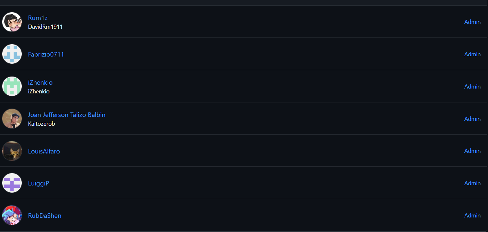
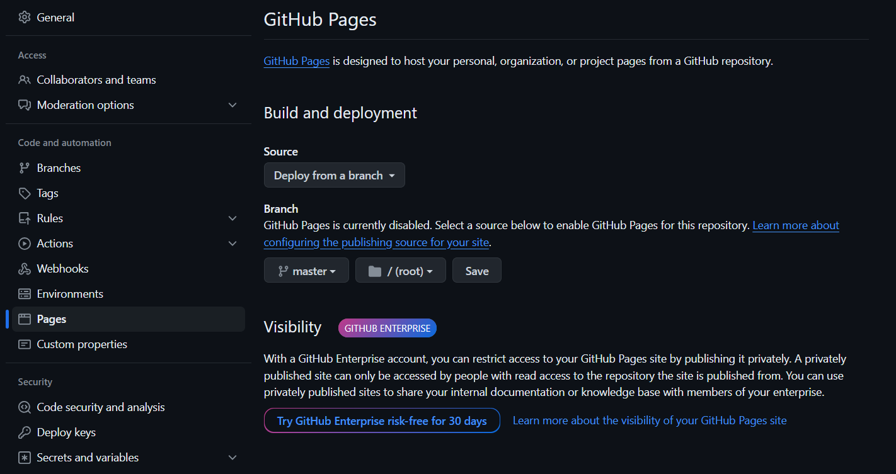

# **Capítulo V: Product Implementation, Validation & Deployment.
La implementación, validación y despliegue del producto son esenciales para asegurar que la visión del producto se convierta en una realidad funcional y accesible para nuestros usuarios. Estas etapas nos permiten transformar el diseño conceptual en una aplicación real, probada y lista para su uso, lo que nos ayuda a validar nuestras ideas, identificar posibles problemas y ofrecer una experiencia de usuario óptima.
## 5.1. Software Configuration Management.
La gestión de la configuración del software es crucial para nuestro trabajo, ya que nos permite mantener un control preciso sobre los elementos de nuestro proyecto, como el código fuente, los documentos de diseño y los activos digitales. Esto garantiza que todos los miembros del equipo estén trabajando con la misma versión de los archivos y facilita la colaboración entre desarrolladores, diseñadores y otros profesionales involucrados en el proyecto.
### 5.1.1. Software Development Environment Configuration.
- ### Project Management:
    * ### Whatsapp:
      Una plataforma de comunicación instantánea, compatible con sistemas operativos Android e iOS, desarrollada por Meta. También dispone de una versión en línea para su uso a través de navegadores web.  
      [Link De Descarga](https://www.whatsapp.com/download//?l=uz&lang=es)
      Link de Descarga: https://www.whatsapp.com/download//?l=uz&lang=es
    * ### Discord:
      Una herramienta de mensajería instantánea diseñada para organizar y facilitar reuniones internas semanales.  
      [Link De Descarga](https://discord.com/download)
      Link de Descarga: https://discord.com/download
    * ### Trello:
      Una aplicación de gestión de proyectos que facilita el seguimiento de las tareas individuales de cada miembro del equipo de manera sencilla.  
      [Link De Registro o Inicio De Sesión](https://trello.com/es)
      Link de Registro: https://trello.com/es
- ### Requirement Management:
    * ### Miro:
      Un sistema que ofrece una amplia gama de plantillas diseñadas para abordar diversos aspectos en la creación y gestión de proyectos.  
      [Link De Registro o Inicio De Sesión](https://miro.com/es/login/)
      Link de Registro: https://miro.com/es/login/
    * ### UXPressia:
      Es una herramienta en línea que simplifica el proceso de mapeo y comprensión de las necesidades del cliente en un proyecto determinado.  
      [Link De Registro o Inicio De Sesión](https://uxpressia.com)
      Link de Registro: https://uxpressia.com
    * ### Structurizr:
      Se trata de una suite de herramientas que posibilita la creación colaborativa de modelos C4 para representar de forma gráfica nuestros productos.  
      [Link De Registro o Inicio De Sesión](https://structurizr.com)
      Link de Registro: https://structurizr.com
    * ### Vertabelo:
      Una plataforma de colaboración que nos permite diseñar conjuntamente el diagrama de nuestra base de datos.  
      [Link De Registro o Inicio De Sesión](https://vertabelo.com)
      Link de Registro: https://vertabelo.com
- ###  Product UX/UI Design:
    * ### Figma:
      Una herramienta de colaboración que facilita el desarrollo conjunto de wireframes y mockups.  
      [Link De Registro,Inicio De Sesión y Descarga](https://www.figma.com/downloads/)
      Link de Registro: https://www.figma.com/downloads/
    * ### LucidChart:
      Una herramienta colaborativa que posibilita la creación conjunta de wireframes flow y mockups flow.  
      [Link De Registro o Inicio De Sesión ](https://www.lucidchart.com/pages/es)
      Link de Registro: https://www.lucidchart.com/pages/es
- ###  Software Development:
    * ### HTML5:
      Es un lenguaje de etiquetado utilizado para crear la estructura a páginas web. Lo utilizamos para incluir componentes como texto, imágenes, enlaces, botones y videos en nuestras páginas web.  
      [Informacion Relacionada](https://www.esic.edu/rethink/tecnologia/html5-que-es-caracteristicas-y-como-funciona-c#:~:text=El%20HTML5%20es%20un%20estándar,%2C%20estilo%20de%20letra%2C%20etc.)
      Información Relacionada: https://www.esic.edu/rethink/tecnologia/html5-que-es-caracteristicas-y-como-funciona-c#:~:text=El%20HTML5%20es%20un%20estándar,%2C%20estilo%20de%20letra%2C%20etc.
    * ### CSS:
      Un lenguaje de diseño gráfico utilizado para dar formato y estilo a la presentación de un documento escrito en HTML.  
      [Informacion Relacionada](https://developer.mozilla.org/es/docs/Web/CSS)
      Información Relacionada: https://developer.mozilla.org/es/docs/Web/CSS
    * ### JavaScript:
      Un lenguaje de programación orientado a objetos dinámico que utilizamos para implementar funcionalidades en un documento HTML.  
      [Informacion Relacionada]( https://developer.mozilla.org/es/docs/Web/JavaScript )
      Información Relacionada: https://developer.mozilla.org/es/docs/Web/JavaScript
    * ### WebStorm:
      Un entorno de desarrollo integrado (IDE) que emplearemos para trabajar con JavaScript.  
      [Link De Descarga]( https://www.jetbrains.com/es-es/webstorm/)
      Link de Descarga: https://www.jetbrains.com/es-es/webstorm/
- ###  Software Testing:
    * ### Lenguaje Gherkin:
      Se trata de un Lenguaje Específico de Dominio (DSL), diseñado específicamente para abordar un problema particular. Es un lenguaje comprensible para los desarrolladores, destinado a resolver necesidades concretas.  
- ###  Software Documentation:
    * ### Github:
      Se trata de una plataforma utilizada para el alojamiento de versiones del código fuente de un proyecto. Es una herramienta ampliamente popular en el trabajo colaborativo de programadores.  
      [Link De Descarga]( https://desktop.github.com)
      Link de Descarga: htts://desktop.github.com
      [Link De Registro o Inicio De Sesión](https://github.com/login)
      Link de Registro: https://github.com/login
- ###  Software Deployment:
    * ### Github Pages:
      Una plataforma que posibilita la realización de despliegues simples directamente desde un repositorio de GitHub.  

### 5.1.2. Source Code Management.
Landing Page Repository: [Landing Page Repository](https://github.com/SecurCar/LandingPage_SecurCar.git) https://github.com/SecurCar/LandingPage_SecurCar.git
- #### GitFlow Implementation:
Para implementar el flujo de trabajo Gitflow utilizando Git como nuestra herramienta de control de versiones, nos basamos en la entrada de blog "A successful Git branching model" de Vincent Driessen. Esta referencia nos permitió establecer las convenciones detalladas que serán aplicadas en nuestro proyecto

### **Master o Main branch**
La rama principal de desarrollo del proyecto es la Master branch. En esta rama reside el código que actualmente se encuentra en producción.
#### Notación: master o main

### **Develop branch**
La rama "Develop" albergará las más recientes actualizaciones y cambios agregados que serán incluidos en la próxima versión del proyecto. Esta rama sirve como un espacio para la integración y prueba continua de los cambios antes de ser fusionados con la rama principal "Master" para su despliegue en producción.
#### Notación: develop

### **Release branch**
La rama de lanzamiento (Release branch) facilitará la preparación de una nueva versión del producto. Esta rama permitirá la corrección de errores y permitirá que la rama Develop reciba más actualizaciones.
 Debe derivarse de la rama Develop.
 Debe fusionarse con la rama Develop y Master.
#### Notación: release

### **Feature branch**
Las ramas de características (Feature branches) serán empleadas para desarrollar nuevas funcionalidades o características del producto que se agregarán en la siguiente versión o en versiones futuras. Estas funcionalidades deberán fusionarse eventualmente con la rama Develop.
 Debe derivarse de la rama Develop.
 Debe fusionarse de vuelta a la rama Develop.
#### Notación: release

### **Hotfix branch**
La rama de corrección rápida (Hotfix branch) se empleará para resolver y actuar de manera inmediata ante posibles errores en la versión en producción del producto. La característica principal de esta rama es que permite preparar una solución rápida mientras el resto del equipo continúa trabajando en otras funcionalidades o mejoras.
 Debe derivarse de la rama Master
 Debe fusionarse con la rama Develop y Master
#### Notación: hotfix

### **Conventional Commits**
"Conventional Commits" es una convención para estructurar los mensajes de confirmación (commits) en un formato estándar y semántico. Este formato ayuda a comunicar claramente los cambios realizados en el código y facilita la generación de registros de cambios automáticos. Los "Conventional Commits" suelen seguir un formato que incluye un encabezado, un cuerpo opcional y un pie de página opcional, y se utilizan para describir de manera sucinta y clara los cambios realizados en el código, lo que facilita su seguimiento y comprensión por parte de los desarrolladores y otros miembros del equipo.
 
La estructura de un commit debe seguir las siguientes pautas:
~~~
git commit -m “<type>[optional scope]: <title>“ -m “<description”
~~~
**Tipos De Conventional Commits**
~~~
1. **feat**: Se usa para describir una nueva característica o funcionalidad añadida al código.
2. **fix**: Indica una corrección de errores o solución a un problema.
3. **docs**: Se emplea para cambios o mejoras en la documentación del código.
4. **style**: Describe cambios relacionados con el formato del código, como espacios en blanco, sangrías, etc., que no afectan su funcionalidad.
5. **refactor**: Se utiliza para modificaciones en el código que no corrigen errores ni añaden nuevas funcionalidades, sino que mejoran su estructura o legibilidad.
6. **test**: Indica la adición o modificación de pruebas unitarias o funcionales.
7. **chore**: Se usa para cambios en el proceso de construcción o tareas de mantenimiento que no están directamente relacionadas con el código en sí.
8. **perf**: Describe mejoras de rendimiento en el código.
~~~

### 5.1.3. Source Code Style Guide & Conventions.
Como norma general, se espera que todo el código desarrollado por los miembros del equipo esté completamente redactado en inglés.
- ### HTML
    - #### Use Lowercase Element Names:
      Es recomendable utilizar minúsculas o lowercase para los nombres de los elementos HTML.
        ~~~ 
      <body>
            
Esto es un párrafo

      <body>
       ~~~
    - #### Close All HTML Elements:
      Es recomendable cerrar todos los elementos HTML correctamente.
        ~~~ 
      <body>
            
Esto es un párrafo

            
Esto es otro párrafo

      <body>
       ~~~
    - #### Use Lowercase Attribute Names:
      Es recomendable utilizar minúsculas para los nombres de los atributos HTML.
      ~~~ 
      <a href="https://www.w3schools.com/html/">Visit our HTMLtutorial</a>
       ~~~
    - #### Always Specify alt, width, and height for Images:
      Es recomendable seguir estas convenciones en caso de que la imagen no se pueda mostrar, lo que ayuda a mejorar la accesibilidad del contenido.
      ~~~ 
      
      ~~~ 
    - #### Spaces and Equal Signs:
      Se recomienda no utilizar espacios en blanco entre las entidades para mejorar la legibilidad.
      ~~~ 
      <link rel="stylesheet" href="styles.css">
      ~~~ 
- ### CSS
    - #### ID and Class Naming
      Es recomendable utilizar nombres de clases y IDs significativos que expresen claramente el propósito del elemento.
      ~~~ 
      #gallery {}
      #login {}
      .video {}
       ~~~
    - #### ID and Class Name Style
      Se recomienda utilizar nombres cortos para nombrar IDs o clases, pero lo suficientemente descriptivos para entender su propósito.
      ~~~ 
      #nav {}
      .author {}
      ~~~
    - #### Shorthand Properties
      Se recomienda utilizar propiedades CSS de forma abreviada siempre que sea posible para hacer el código más eficiente y comprensible.
       ~~~ 
       border-top: 0;
       font: 100%/1.6 palatino, georgia, serif;
       padding: 0 1em 2em;
       ~~~ 
    - #### 0 and Units
      Es recomendable evitar especificar la unidad después del valor 0 en propiedades que lo permitan, ya que esto ayuda a reducir el tamaño del código y mejora su legibilidad.
       ~~~ 
       margin: 0;
       padding: 0;
       ~~~
    - #### Declaration Order
      Se recomienda ordenar las declaraciones en orden alfabético para facilitar el mantenimiento y la recordación del código.
      ~~~ 
       background: fuchsia;
       border: 1px solid;
       border-radius: 4px;
       color: black;
       text-align: center;
       text-indent: 2em;
      ~~~  
- ### JAVASCRIPT
    - #### Use expanded syntax
      Cada línea de JavaScript debería estar en una nueva línea, con la llave de apertura en la misma línea de su declaración y la llave de cierre en una nueva línea al final.
      ~~~ 
      function myFunc() {
       console.log('Hello!');
      };
      ~~~
    - #### Variable naming
      Para el nombre de las variables, se recomienda utilizar lowerCamelCase.
      ~~~ 
      let playerScore = 0;
      let speed = distance / time;
      ~~~  
    - #### Declaring variables
      Para la declaración de variables, es recomendable utilizar las palabras reservadas let y const en lugar de var.
      ~~~ 
      const myName = 'Chris';
      console.log(myName);
      let myAge = '40';
      myAge++;
      console.log('Happy birthday!');
      ~~~ 
    - #### Function naming
      Para el nombre de las funciones, se recomienda utilizar lowerCamelCase.
      ~~~ 
      function sayHello() {
      alert('Hello!');
      };
      ~~~
- ### Java
  - #### CamelCase Naming Convention
    Esta convención sugiere nombrar variables, métodos y clases utilizando CamelCase, donde cada palabra en el identificador comienza con una letra mayúscula, excepto la primera palabra.
    ~~~ 
    int miVariable;
    void miMetodoNombre() {
        // Cuerpo del método
    }
    class MiClase {
        // Miembros de la clase
    }
    ~~~
  - #### Constants Naming Convention
    Las constantes generalmente se nombran utilizando letras mayúsculas con guiones bajos para separar palabras y distinguirlas de las variables regulares.
    ~~~ 
    final int VALOR_MAXIMO = 100;
    ~~~
  - #### Comments Convention
    Los comentarios deben utilizarse para explicar la funcionalidad del código, especialmente en secciones complejas o no intuitivas, utilizando un lenguaje claro y conciso.
    ~~~ 
    // Este método calcula la suma de dos números
    int suma(int num1, int num2) {
        return num1 + num2;
    }
    ~~~ 
  - #### Method Naming Convention
    Los nombres de los métodos deben ser descriptivos y comenzar con un verbo en minúsculas, seguido de un sustantivo (o sustantivos) que describa la acción del método.
    ~~~ 
    void calcularSuma() {
        // Cuerpo del método
    }
    ~~~
  - #### Indentation Convention
    La indentación consistente mejora la legibilidad del código. Cada nivel de anidamiento de código debe ser indentado por un número fijo de espacios o tabulaciones.
    ~~~ 
    public class MiClase {
        public static void main(String[] args) {
            if (condicion) {
                // Bloque de código indentado
                System.out.println("¡Hola, Mundo!");
            }
       
        }
    }
    ~~~
   - ### TypeScript
    - #### CamelCase Naming Convention
      Esta convención sugiere nombrar variables, métodos y clases utilizando CamelCase, donde cada palabra en el identificador comienza con una letra mayúscula, excepto la primera palabra.
      ~~~ 
      let miVariable: number;
      function miFuncionNombre() {
          // Cuerpo de la función
      }
      class MiClase {
          // Miembros de la clase
      }
      ~~~
   - #### PascalCase Naming Convention
     PascalCase es similar a CamelCase, pero la primera letra de cada palabra en el identificador se capitaliza, incluida la primera palabra.
     ~~~ 
     let MiVariable: number;
     function MiFuncionNombre() {
         // Cuerpo de la función
     }
     class MiClase {
         // Miembros de la clase
     }
     ~~~
   - #### Uppercase Constants
     Las constantes se nombran en mayúsculas con guiones bajos para separar palabras.
     ~~~ 
     const VALOR_MAXIMO: number = 100;
     ~~~ 
   - #### Descriptive Comments
     Los comentarios deben explicar la funcionalidad del código de manera clara y concisa.
     ~~~ 
     // Esta función calcula la suma de dos números
     function sumar(num1: number, num2: number): number {
         return num1 + num2;
     }
     }
     ~~~
   - #### Indentation Convention
     Es importante mantener una indentación consistente para mejorar la legibilidad del código.
     ~~~ 
     class MiClase {
         metodo(): void {
             if (condicion) {
                 // Bloque de código indentado
                 console.log("Hola, Mundo!");
             }
      
         }
     }
     ~~~
- ### LENGUAJE GHERKIN
    - #### Descriptive and concise titles for scenarios
      Utilizar títulos descriptivos y concisos para los escenarios.
      ~~~ 
      Feature: Login
        Scenario: Successful login
          Given a user is on the login page     
          When they enter valid credentials     
          Then they should be logged in successfully      
      ~~~
    - #### Follow the Given-When-Then structure consistently.
      Seguir la estructura de Given-When-Then de manera consistente.
      ~~~ 
      Scenario: Adding items to the shopping cart
        Given the user is on the shopping page
        When they add an item to the cart
        Then the item should appear in the cart 
      ~~~
    - #### Focus on business-readable language
      Centrarse en un lenguaje legible para el negocio, evitando detalles técnicos de implementación.
      ~~~ 
      Scenario: Changing user settingst
        Given the user is logged in
        When they navigate to the settings page
        Then they should be able to update their profile
      ~~~
    - ####  Utilize Scenario Outline for scenarios with multiple similar cases.
      Utilizar Scenario Outline para escenarios con múltiples casos similares.
      ~~~ 
      Scenario Outline: Searching for products
        Given the user is on the search page
        When they search for "<product>"
        Then they should see search results for "<product>"
      
      Examples:
        | product  |
        | Laptop   |
        | Smartphone |
      ~~~
    - #### Add comments to provide additional context
      Agregar comentarios para proporcionar contexto adicional o explicaciones cuando sea necesario.
      ~~~ 
      # This scenario checks the functionality of the logout feature
      Scenario: User logout
        Given the user is logged in
        When they click on the logout button
        Then they should be redirected to the login page      
      ~~~
### 5.1.4. Software Deployment Configuration.
- Creacion Landing Page: 
1. Se crea un repositorio remoto en GitHub
   
2. Agregar a participantes
   
3. Habilitmos Gitgub Pages en branch "master" y ruta "/(root)"
   

## 5.2. Landing Page, Services & Applications Implementation.
La implementación de la página de inicio, los servicios y las aplicaciones es un paso fundamental en nuestro proceso de desarrollo. Nos permite materializar el diseño y la funcionalidad planificados, transformando los conceptos en productos tangibles y listos para su uso. Esta fase nos permite traducir las especificaciones y requisitos en código, desarrollando la estructura de la página, los servicios y las aplicaciones de acuerdo con las necesidades identificadas.
### 5.2.1. Sprint 1
El primer sprint es un hito importante en nuestro proceso de desarrollo ágil. Durante este período, nos enfocamos en la implementación de las características y funcionalidades prioritarias identificadas en la planificación inicial. Esto implica traducir los requisitos y especificaciones en código funcional, desarrollando las bases de nuestro producto de manera iterativa.
#### 5.2.1.1. Sprint Planning 1.
En este sección, están las reuniones que se realizaron para llevar a cabo la landing page. 

| Sprint # | Sprint #1 |
| -------- | --------|
| Sprint Planning Background |
| Date | 2024-04-07 |
| Time | 05:25 PM |
| Location | Discord (virtual) |
| Prepared by | Gallo Quintana, David Ivanoff |
| Attendes (to planning meeting) | Gallo Quintana, David Ivanoff / Mallma Quispe, Ruben / Paredes Zapata, Luiggi Gianfranco / Sanchez Zamora, Fabrizio Alessandro / Talizo Balbin, Joan Jefferson / Louis |
| Sprint Goal & User Stories |    |
| Sprint 1 Goal | Realizar la Landing Page |
| Sprint 1 Velocity | 20 |
| Sum of Story Points | 8 |

#### 5.2.1.2. Sprint Backlog 1.
| id   | Title                  | Id  | Title                                                    | Description                                                                                                   | Estimations(Hours) | Assigned To   | Status(To-do /InProcess/ToReview/Done) |
| ---- | ---------------------- | --- | -------------------------------------------------------- | ------------------------------------------------------------------------------------------------------------- | ------------------ | ------------- | -------------------------------------- |
| US31 | Navegar a la Página de Inicio     | TS01 |Header and NavBar responsivos (Desarrollado en HTML, CSS y JS).          | Implementación del header y la barra de navegación, siguiendo los estándares “Responsive”  | 3                  | Luiggi  | Done                                   |
| US32 | Obtener mayor información acerca de los beneficios    | TS02 | Sección de Testimonios (Desarrollado en HTML, CSS y JS).       | Implementación de la sección de testimonios en la Landing Page, siguiendo los estándares “Responsive”  | 3                  | Balbín | Done                                   |
| US33 | Contacto con soporte           | TS03 | Sección del Footer (Desarrollado en HTML, CSS y JS).                              | Implementación del footer en la Landing Page, siguiendo los estándares “Responsive”.           | 2                  | David   | Done                                   |

#### 5.2.1.3. Development Evidence for Sprint Review.
| Repository   | Branch                                      | Commit Id | Commit Message                   | Commit Message Body | Commited on (Date) |
| ------------ | ------------------------------------------- | --------- | -------------------------------- | ------------------- | ------------------ |
| LandingPage_SecurCar  | main | d978b63    | feat: added HTMLParte  | Feat:….  | 10/04/2024         |
| LandingPage_SecurCar   | main | be2b1b4    | feat:added section offer and images      | Feat:…. | 09/04/2024         |
| LandingPage_SecurCar   | main | a46db65 | feat: added section mapas and images  |Feat:…. | 09/04/2024         |
| LandingPage_SecurCar   | main | f284b3d    | feature(LandingPage):Add SectionAboutUs   |Feat:….  | 10/04/2024         |
| LandingPage_SecurCar  | main  | 1096c95  | feat: added stylessx and contact section   |Feat:….   | 10/04/2024         |

#### 5.2.1.4. Testing Suite Evidence for Sprint Review.
En esta entrega, no se incluyeron los componentes relacionados con los servicios web, ya que en este caso solo se implemento la Landing Page.
#### 5.2.1.5. Execution Evidence for Sprint Review.
Se puede visualizar el video en el siguiente enlace: https://upcedupe-my.sharepoint.com/:v:/g/personal/u20201e475_upc_edu_pe/EQ802LC1j8hDmhP_sOLedJYBdbplYqsSNMldJEnZQhtfvg?e=t0KGDa&nav=eyJyZWZlcnJhbEluZm8iOnsicmVmZXJyYWxBcHAiOiJTdHJlYW1XZWJBcHAiLCJyZWZlcnJhbFZpZXciOiJTaGFyZURpYWxvZy1MaW5rIiwicmVmZXJyYWxBcHBQbGF0Zm9ybSI6IldlYiIsInJlZmVycmFsTW9kZSI6InZpZXcifX0%3D
#### 5.2.1.6. Services Documentation Evidence for Sprint Review.
En esta entrega, nos enfocamos en Landing page, por lo que no fue necesario ningún servicio adicional.
#### 5.2.1.7. Software Deployment Evidence for Sprint Review.
En este caso se uso GitHub Pages, para desplegar la Landing page, el cual nos sirvio para, a partir de un código en un repositorio poder desplegar la página. Enlace de la landing page: securcar.github.io/LandingPage_SecurCar/
#### 5.2.1.8. Team Collaboration Insights during Sprint.
Para llevar a cabo este proyecto se usaron distintas herramientas como Visual Studio Code, Rider, Webstorm; junto con Git. En este caso se dividio la landing page mostrada anteriormente en sectores, a partir de esto cada uno presentó su parte y luego un miembro realizó el styles para finalmente tener el resultado deseado.

### 5.2.2. Sprint 2
El primer sprint es un hito importante en nuestro proceso de desarrollo ágil. Durante este período, nos enfocamos en la implementación de las características y funcionalidades prioritarias identificadas en la planificación inicial. Esto implica traducir los requisitos y especificaciones en código funcional, desarrollando las bases de nuestro producto de manera iterativa.
#### 5.2.2.1. Sprint Planning 1.
En este sección, están las reuniones que se realizaron para llevar a cabo la landing page. 

<table>
        <tr>
            <td colspan="1">Sprint #</td>
            <td colspan="1">Sprint 2</td>
        </tr>
        <tr>
            <td colspan="2">Sprint Planning Background</td>
        </tr>
        <tr>
            <td>Date</td>
            <td>2024-04-29</td>
        </tr>
          <tr>
            <td>Time</td>
            <td>05:25 PM</td>
        </tr>
            <tr>
            <td>Location</td>
            <td>Discord (virtual)</td>
        </tr>
            <tr>
            <td>Prepared by</td>
            <td>Gallo Quintana, David Ivanoff</td>
        </tr>
            <tr>
            <td>Attendees (to planning meeting)</td>
            <td>Gallo Quintana, David Ivanoff / Mallma Quispe, Ruben / Paredes Zapata, Luiggi Gianfranco / Sanchez Zamora, Fabrizio Alessandro / Talizo Balbin, Joan Jefferson / Louis</td>
        </tr>
            <tr>
            <td>Sprint 2 Review Summary</td>
            <td>El proceso del sprint 2 concluyó en términos de avances y mejoras de los productos y entregables dado junto con la colaboración general del equipo y la comunicación. Los logros alcanzados junto a la retroalimentación con la recopilación durante esta revisión proporcionan una buena y sólida base para la construcción y realización del siguiente sprint (3), además de reforzar el compromiso del equipo con la calidad y la entrega responsable.</td>
        </tr>
            <tr>
            <td>Sprint 2 Retrospective Summary</td>
            <td>Para la retrospectiva del Sprint 2 tuvimos que reflexionar sobre nuestro desempeño grupal como individual de cada integrante, además de identificar todas las secciones posibles donde podemos mejorar como también del uso de recomendaciones. Esto nos servira como una buena base para impulsar aun más la mejora continua y optimizar el trabajo del equipo en los próximos sprints durante el ciclo de vida del proyecto.</td>
        </tr>
            <tr>
            <td colspan="2">Sprint Goal & User Stories</td>
        </tr>
              <tr>
            <td>Sprint 2 Goal</td>
            <td>Alcanzar una métrica de cumplimiento del 100%, lo que indicará que se ha logrado todos los objetivos del sprint 2 con todas las historias de usuario y otros materiales necesarios.</td>
        </tr>
              <tr>
            <td>Sprint 2 Velocity</td>
            <td>Con el equipo para este sprint 2 decidimos aceptar 8 Story Points</td>
        </tr>
              <tr>
            <td>Sum of Story Points</td>
            <td>La suma de los Story Points para los User Stories que se están incluyendo en este Sprint 2 es 47</td>
        </tr>
    </table>

#### 5.2.2.2. Sprint Backlog 2.
| id | Title | Id | Title | Description | Estimations | Assigned To | Status |
| - | - | - | - | - | - | - | - |
| US01 | Protección contra robos y alertas de seguridad | TS01 | Sección de ajustes de notificaciones sobre alertas en información del vehículo | Como joven conductor, quiero activar la función de seguridad en la aplicación para proteger mi automóvil contra robos y recibir alertas instantáneas en caso de actividad sospechosa. | 2 hora(s) y 30 minuto(s) | David | Done |
| US02 | Geolocalización y rastreo en tiempo real. | TS01 | Sección de nombre del vehículo con rastrear elemento en información del vehículo | Como joven conductor, quiero activar la función de seguridad en la aplicación para proteger mi automóvil contra robos y recibir alertas instantáneas en caso de actividad sospechosa. | 1 hora(s) y 0 minuto(s) | David | Done |
| US03 | Recomendaciones personalizadas de seguridad. | TS02 | Sección de recomendaciones de seguridad en mensajes | Como propietario de un automóvil, quiero recibir recomendaciones personalizadas sobre medidas de seguridad adicionales según las áreas de alto riesgo de robo en mi área. | 1 hora(s) y 0 minuto(s) | Rubén | Done |
| US05 | Compartir ubicación con contactos de confianza. | TS03 | Compartir la ubicación del vehículo dentro de la sección de compartir vehículo | Como conductor joven, quiero poder compartir mi ubicación en tiempo real con contactos de confianza a través de la aplicación para garantizar mi seguridad. | 1 hora(s) y 30 minuto(s) | David | Done |
| US10 | Recordatorios de límites de velocidad y normativas viales. | TS02 | Dentro de mensajes donde se muestra información importante | Como conductor joven, quiero recibir recordatorios de límites de velocidad y normativas viales en tiempo real para conducir de manera responsable. | 1 hora(s) y 0 minuto(s) | Rubén | InProcess |
| US13 | Gestión de perfiles de conductores múltiples. | TS04 | Sección de perfiles como cambio dentro del apartado pefil | Como conductor joven, quiero poder gestionar múltiples perfiles de conductores en la aplicación para compartir mi vehículo con otros conductores de confianza. | 1 hora(s) y 30 minuto(s) | Joan | Done |
| US19 | Programación de mantenimientos preventivos. | TS04 | Sección de  |Como conductor de flotas, quiero programar mantenimientos preventivos para los vehículos de la empresa en la aplicación para garantizar su buen estado y durabilidad | 2 hora(s) y 30 minutos(s) | Luois | ToDo |

#### 5.2.2.3. Development Evidence for Sprint Review.
| Repository | Branch | Commit Id | Commit Message | Commit Message Body | Commited on date |
| - | - | - | - | - | - |
| FrontEnd | main | 5f99030 | feat: added GPSinformation Component | En esta sección se añadió la información sobre el dispositivo GPS a la branch main | 30/04/2024 |
| FrontEnd | main | 46c79fd | feat: added vehicle information page | Se añadió la sección de información del vehículo a la rama principal | 29/04/2024 |
| FrontEnd | main | 414cecd | feat: added Initial section | Se añadió la sección de inicio a la branch main | 28/04/2024 |
| FrontEnd | main | 055dff0 | feat(login): added html, ts and css | Aquí se añadió la página de login (ingresar cuenta) de nuestra aplicación | 28/04/2024 |
| FrontEnd | main | e55e5c8 | feat: added Profile | Incluído la sección de perfil del conductor (usuario) | 30/04/2024 |
| FrontEnd | main | b2b31b5 | feat: added ratreo branch | Se añadió la sección de rastreo a la rama 'main' | 30/04/2024 |
| FrontEnd | main | 2bcd954 | feat: added register section branch | Creada la sección de registro de usuario a la rama principal | 26/04/2024 |
| FrontEnd | main | b795994 | feat: added Share ubicaction components | En esta sección se añadió el apartado de compartir ubicación a la rama principal | 29/04/2024 |
| FrontEnd | main | 46c79fd | feat: added vehicle information page | Se programó la parte de infomación del vehículo a la rama principal | 29/04/2024 |

#### 5.2.2.4. Execution Evidence for Sprint Review.
Se puede visualizar el video en el siguiente enlace: https://upcedupe-my.sharepoint.com/:v:/g/personal/u20201e475_upc_edu_pe/EQ802LC1j8hDmhP_sOLedJYBdbplYqsSNMldJEnZQhtfvg?e=t0KGDa&nav=eyJyZWZlcnJhbEluZm8iOnsicmVmZXJyYWxBcHAiOiJTdHJlYW1XZWJBcHAiLCJyZWZlcnJhbFZpZXciOiJTaGFyZURpYWxvZy1MaW5rIiwicmVmZXJyYWxBcHBQbGF0Zm9ybSI6IldlYiIsInJlZmVycmFsTW9kZSI6InZpZXcifX0%3D
#### 5.2.2.5. Services Documentation Evidence for Sprint Review.
En esta entrega no usamos servicios externos por lo que no se usó ningún servicio adicional.
#### 5.2.2.6. Software Deployment Evidence for Sprint Review.
Usamos el entorno local para poder desarrollar primero la ejecución y el recorrido de la página para poder después llevarla a producción o a un entorno más complejo.
#### 5.2.2.7. Team Collaboration Insights during Sprint.
Para llevar a cabo este proyecto se usaron distintas herramientas como Visual Studio Code, Rider, Webstorm; junto con Git. En este caso se dividió el FrontEnd mostrada anteriormente en sectores, a partir de esto cada uno presentó su parte y luego un miembro realizó el styles para finalmente tener el resultado deseado.

## 5.2.3. Sprint 3
En este Sprint 3 vamos a definir las actividades realizadas respecto a nuestro BackEnd como a nuestro FrontEnd. Como grupo, hemos considerado las correciones y mejoras de nuestro profesor hacia nuestra últime entrega (TP), y las hemos aplicado en esta entrega. Ahora presentamos nuestro Sprint 3.

### 5.2.3.1.Sprint Planning 3.
Para la planificación de nuestro Sprint 3, hemos definido varias historias de usuario a considerar. Entre ellas, hemos escogido las historias de usuario que puedan añadir valor a nuestro proyecto como el registro, login, y funcionalidades principales de nuestro sistema. A continuación, presentamos el Sprint Planning 3 a más detalle. 

<table>
        <tr>
            <td colspan="1">Sprint #</td>
            <td colspan="1">Sprint 3</td>
        </tr>
        <tr>
            <td colspan="2">Sprint Planning Background</td>
        </tr>
        <tr>
            <td>Date</td>
            <td>24-05-2024</td>
        </tr>
          <tr>
            <td>Time</td>
            <td>08:52 PM</td>
        </tr>
            <tr>
            <td>Location</td>
            <td>Discord (virtual)</td>
        </tr>
            <tr>
            <td>Prepared by</td>
            <td>Gallo Quintana, David Ivanoff</td>
        </tr>
            <tr>
            <td>Attendees (to planning meeting)</td>
            <td>Gallo Quintana, David Ivanoff / Mallma Quispe, Ruben / Paredes Zapata, Luiggi Gianfranco / Sanchez Zamora, Fabrizio Alessandro / Talizo Balbin, Joan Jefferson / Louis</td>
        </tr>
            <tr>
            <td>Sprint 3 Review Summary</td>
            <td>Para este Sprint 3, hemos decidido principalmente implmentar aquellas historias de usuario que añadan valor significativo a nuestro proyecto ya que consideramos otras funcionalidades extras (o que necesitan de otras) aún no necesarias puesto que priorizamos primero las historias de usuario que sean de gran importancia y valor primero. Además, en este Sprint 3, hemos decidido implementrar las correciones indicadas por el profesor como correciones o posibles mejoras a nuestro FrontEnd (Aplicación Web) y también mejoras a nuestro reporte.</td>
        </tr>
            <tr>
            <td>Sprint 3 Retrospective Summary</td>
            <td>Para la retrospectiva de Sprint 3, hemos analizado en conjunto el uso de nuestro tiempo como equipo para poder organizarnos mejor. Usamos herramientas como Trello para poder asignar tareas y coordinarlas para que de esta forma poder tener mejor control de nuestro proyecto. Por defecto a la asignación de tareas, hemos decidido asignar cada tarea a procesos más pequeños para que todo podamos trabajar eficientemente. Esta organización consiste en los dominios y dividir nuestro proyecto grande en pequeñas partes más manejables.</td>
        </tr>
            <tr>
            <td colspan="2">Sprint Goal & User Stories</td>
        </tr>
              <tr>
            <td>Sprint 3 Goal</td>
            <td>La meta para este Sprint 3 fue hacer las primeras versiones de nuestro BackEnd (como primeras impresiones y versiones). También, hemos incluído entre nuestras metas hacer la mejora continua de nuestro repositorios (FrontEnd, Reporte y LandingPage). Internamente, como grupo, nos propusimos a mejorar nuestra organización por medio de aplicativos como Trello o ClickUp. De esta forma, hemos definido nuestras metas correctamente.</td>
        </tr>
              <tr>
            <td>Sprint 3 Velocity</td>
            <td>Para este Sprint 3, nuestro Sprint 3 Velocity es de 8 puntos</td>
        </tr>
              <tr>
            <td>Sum of Story Points</td>
            <td>La suma de las historias de usuario para el Sprint 3, alcanza un valor de ...... puntos en total</td>
        </tr>
    </table>
    
### 5.2.3.2.Sprint Backlog 3.

### 5.2.3.3.Development Evidence for Sprint Review.

### 5.2.3.4.Testing Suite Evidence for Sprint Review.

### 5.2.3.5.Execution Evidence for Sprint Review.

### 5.2.3.6.Services Documentation Evidence for Sprint Review.

### 5.2.3.7.Software Deployment Evidence for Sprint Review.

### 5.2.3.8.Team Collaboration Insights during Sprint.

## 5.3. Validation Interviews.

### 5.3.1. Diseño de Entrevistas.
#### Saludo y presentación
Comenzamos con una introducción breve de los entrevistados para recordar quiénes son ya que han sido entrevistados anteriormente.

1. ¿Cómo se llama?
2. ¿Cuántos años tiene?
3. ¿En qué distrito vive?

#### Preguntas
Estas preguntas nos ayudarán a saber cuál es la experiencia de usuario, si nuestro producto llenó las expectativas del usuario, y también saber las posibles mejoras, comentarios y quejas sobre nuestro producto.

1. ¿Qué piensas de la interfaz de usuario de la aplicación web? ¿Es fácil de navegar?
2. ¿Encuentras que las funciones de la aplicación web son intuitivas y fáciles de usar?
4. ¿Hay alguna función que crees que debería estar en la aplicación web que actualmente no está?
5. ¿Cómo calificarías la experiencia general de uso de la aplicación web?
6. ¿Qué te gusta más y qué te gusta menos de la aplicación web?
7. ¿Te sentirías cómodo usando regularmente nuestra aplicación web?
8. ¿Cómo crees que nuestra aplicación web se comparan con otras similares que hayas utilizado?
9. ¿Hay algo que te confunda o te resulte difícil de entender en la aplicación web?
10. ¿Considerarías recomendarnos a tus amigos o familiares?
11. ¿Tienes alguna sugerencia para mejorar la experiencia del usuario en nuestra aplicación web?

### 5.3.2. Registro de Entrevistas.
  - **Taxistas Experimentados:**

  **Entrevista #2**  
  Nombre y apellidos: Maykol Valencia  
  Edad: 22 años  
  Distrito: Selva Alegre  
   
  Inicio de Entrevista: 00:01  
  [URL_De_Entrevista](https://upcedupe-my.sharepoint.com/:v:/g/personal/u202223781_upc_edu_pe/ETf3Yo1xS1tNiR092WP4suMBwr2uSH10JhYYjoKxnJ342A?nav=eyJyZWZlcnJhbEluZm8iOnsicmVmZXJyYWxBcHAiOiJTdHJlYW1XZWJBcHAiLCJyZWZlcnJhbFZpZXciOiJTaGFyZURpYWxvZy1MaW5rIiwicmVmZXJyYWxBcHBQbGF0Zm9ybSI6IldlYiIsInJlZmVycmFsTW9kZSI6InZpZXcifX0%3D&e=PAF0Ei) 
  
  Resumen de entrevista: Maykol Valencia, de 22 años, evaluó positivamente la aplicación web SecurCar, diseñada para prevenir el robo de vehículos. Destacó la comodidad, orden y facilidad de uso de la interfaz, señalando que las funciones son intuitivas y bien detalladas. Calificó su experiencia como muy agradable y menos estresante en comparación con otras aplicaciones. Aunque no sugiere mejoras inmediatas, está dispuesto a recomendarla a amigos y familiares, especialmente a quienes usan vehículos para servicios de taxi, por considerarla innovadora y útil para la prevención de robos.
    
  **Entrevista #3**  
  Nombre y apellidos: Rubén Mallma  
  Edad: 49 años  
  Distrito: Villa María del Triunfo  
   
  Inicio de Entrevista: 00:01  
  [URL_De_Entrevista](https://upcedupe-my.sharepoint.com/:v:/g/personal/u202214234_upc_edu_pe/EYn6HNIEpvlBsXRrKCI6FDwBcjkvdHXff0sF8fUeI2UVHA?e=1Bhava) 

  Resumen de entrevista: El señor Rubén ahora nos da su opinión acerca de nuestra primera versión de la aplicación web que estamos desarrollando. Nos comenta además que quisiera que la aplicación funcione completamente ya que es difícil dar una opinión sólida sobre algo que aún no está terminado.
- **Conductores Jovenes:**
  **Entrevista #1** 
  Nombre y apellidos: Renzo Enciso  
  Edad: 20 años  
  Distrito: Chorrillos  
   
  Inicio de Entrevista: 00:00  

  Resumen de entrevista: El usuario encuentra la interfaz de la aplicación web atractiva y fácil de navegar, destacando la organización clara de los menús y opciones. Las funciones son intuitivas y fáciles de usar, pero sugiere agregar notificaciones en tiempo real para mejorar la seguridad. Califica la experiencia general como muy positiva, apreciando la rapidez y la eficacia, aunque señala la falta de notificaciones en tiempo real como una desventaja.
     En comparación con otras aplicaciones, destaca su simplicidad y rapidez, y no encuentra nada confuso o difícil de entender. El usuario recomendaría la aplicación a amigos y familiares por su utilidad y facilidad de uso. También sugiere agregar tutoriales interactivos para mejorar la experiencia del usuario y aumentar la confianza en la aplicación.
    [URL_De_Entrevista](https://upcedupe-my.sharepoint.com/:v:/g/personal/u202213652_upc_edu_pe/EdSnLql-TytMp5kcwwU_joYBB3CsmTrE_xqth_SVaAjicA?e=mwYuGL&nav=eyJyZWZlcnJhbEluZm8iOnsicmVmZXJyYWxBcHAiOiJTdHJlYW1XZWJBcHAiLCJyZWZlcnJhbFZpZXciOiJTaGFyZURpYWxvZy1MaW5rIiwicmVmZXJyYWxBcHBQbGF0Zm9ybSI6IldlYiIsInJlZmVycmFsTW9kZSI6InZpZXcifX0%3D) 

  - **Conductores Jovenes:**
  **Entrevista #2** 
   Nombre y apellidos: Daniela Chavez  
  Edad: 21 años  
  Distrito: Magdalena del Mar  
   
  Inicio de Entrevista: 00:00  

  Resumen de entrevista: En este caso la señorita Daniela comunica que la página si cumple con su función, ademas que definitivamente resulta intuitiva. Aún así considera que hay campo de mejora, por ejemplo menciona que cree que los botones importantes de redirección deberian de ser de un color más distintivo. Finalmente menciona que es una página que si recomendaría, puesto que es importante asegurar nuestros vehículos. 
  **Entrevista #4** 
   Nombre y apellidos: Alonso Carrillo  
  Edad: 23 años  
  Distrito: Santiago de Surco  
   
  Inicio de Entrevista: 00:00  

  Resumen de entrevista: En este caso Alonso menciona en varias ocasiones que la página es intuitiva y fácil de utilizar. Sugiere agregar poder compartir la ubicación en tiempo real para mejorar la seguridad. Califica su experiencia general como positiva, finalmente añadió que si recomendaría nuestra app web, porque la seguridad de un bien material es tema muy importante.
 

### 5.3.3. Evaluaciones según heurísticas.
Por definir...

## Conclusiones 
- Para tener éxito durante la elaboración del proyecto es necesario que todos los integrantes participen y colaboren de manera equitativa, para que el proyecto pueda ser finalizado de manera rápida.

- Es bastante importante la realización de User stories junto con product backlog para definir las necesidades de los usuarios asi como clasificarlos por su importancia, esto con el objetivo de realizar las necesidades más importantes primero.

- Para tener éxito, es esencial abordar el riesgo de errores funcionales mediante pruebas y mejoras continuas.

